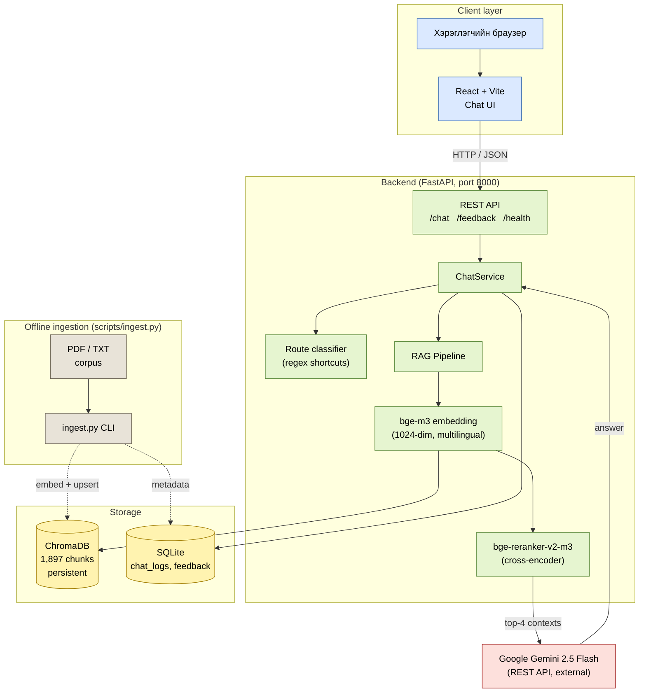
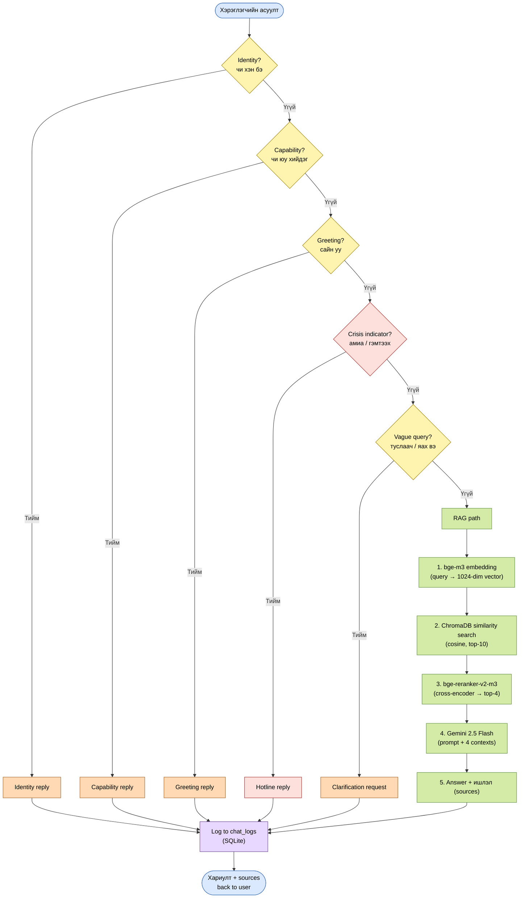
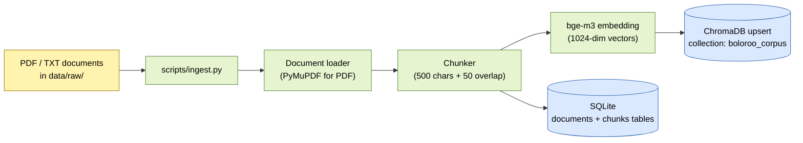

# Boloroo — Architecture & Workflow Diagrams

Mermaid diagrams describing the current system (no admin, ChromaDB + Gemini stack).
Render on GitHub, VS Code (with the Mermaid preview extension), or any Mermaid live editor (https://mermaid.live).

---

## Architecture diagram



### Components at a glance

| Layer | Component | Purpose |
|---|---|---|
| Client | React + Vite | Chat UI, source panel, feedback buttons |
| Backend | FastAPI | 3 endpoints: `/chat`, `/feedback`, `/health` |
| Backend | ChatService | Routes incoming queries; orchestrates RAG |
| Backend | Route classifier | Regex shortcuts (identity, capability, greeting, crisis, vague) — no LLM |
| Backend | RAG pipeline | Embed → search → rerank → generate |
| Embedding | bge-m3 | 1024-dim multilingual dense vectors |
| Reranker | bge-reranker-v2-m3 | Cross-encoder, top-4 selection |
| Store | ChromaDB | Persistent vector store (1,897 chunks) |
| Store | SQLite | chat_logs, feedback |
| External | Gemini 2.5 Flash | Answer generation via REST API |
| Offline | `scripts/ingest.py` | One-time corpus build (CLI) |

---

## Workflow diagram (chat query lifecycle)



### Routing logic at a glance

| Order | Route | Trigger | LLM call? | Typical latency |
|---|---|---|---|---|
| 1 | identity_shortcut | "чи хэн бэ", "өөрийгөө танилцуул" | No | ~4 ms |
| 2 | capability_shortcut | "чи юу хийж чадах вэ" | No | ~5 ms |
| 3 | greeting (shortcut) | "сайн уу", "hello" | No | ~3 ms |
| 4 | **crisis_hotline** | "амиа", "өөрийгөө хорлох", "тэсэхгүй байна" | **No (regex)** | ~5 ms |
| 5 | vague_shortcut | "туслаач", "яах вэ" (short queries) | No | ~5 ms |
| 6 | **RAG path** | Everything else | **Yes (Gemini)** | ~2.6 s p50 |

The crisis path is deterministic and runs *before* the RAG path so safety-critical phrasing never depends on the LLM being available.

---

## Offline corpus ingestion (sub-flow)



Run once after adding/updating documents:

```bash
.venv/Scripts/python.exe scripts/ingest.py
```

The chatbot itself is read-only against the corpus at runtime — no document upload API exists.
