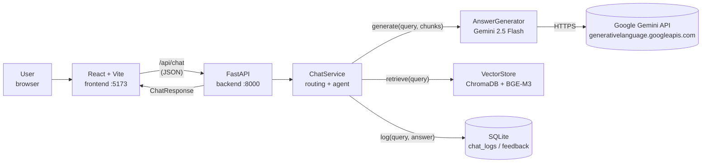
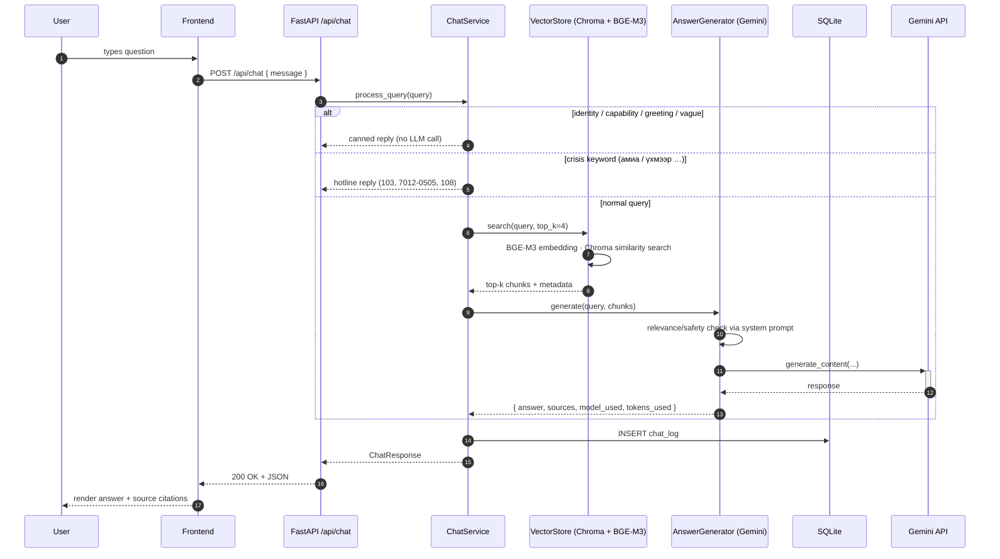
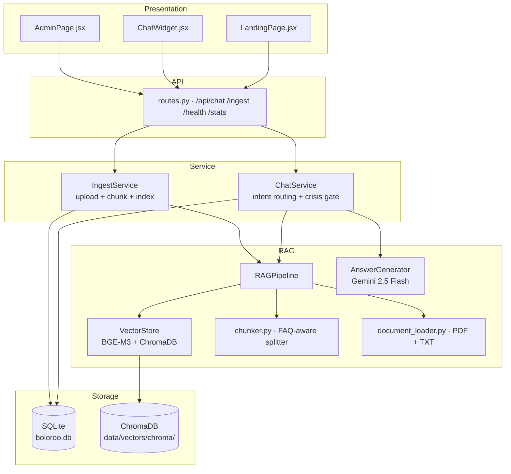

# Тэгшбот / Boloroo — Thesis Project Guide

> A Mongolian Retrieval-Augmented Generation (RAG) chatbot for gender
> equality, anti-discrimination, and disability-rights questions, grounded
> in Mongolian legislation.

**Author:** Bolortuya
**Project:** Bachelor thesis, 2026
**Last updated:** 2026-05-15

---

## 1. Project Overview

Тэгшбот is a closed-domain conversational assistant that answers Mongolian-language
questions in three areas:

1. **Hүйсийн тэгш эрх / Gender equality** — equal opportunity, workplace harassment, gender-based violence.
2. **Ялгаварлан гадуурхалт / Anti-discrimination** — protected categories, complaint procedures, school harassment.
3. **Хөгжлийн бэрхшээлтэй иргэдийн эрх / Disability rights** — inclusive education, accessibility, employment.

Every reply is grounded in an indexed corpus of Mongolian legal documents
(constitution articles, Labor Law, Gender Equality Act 2011, Disability
Rights Act 2016, Family Violence Act, Civil Code) plus curated FAQ
material. The assistant cites the law article and source document for
each answer so the user can verify the legal basis.

The user-facing problem the project addresses: Mongolian citizens
frequently do not know which law protects them, which agency to contact,
or what their entitlements are. Existing online resources are
fragmented, English-dominant, or require expert legal interpretation.
A Mongolian-language assistant grounded in primary legal sources lowers
that friction.

---

## 2. System Architecture

### 2.1 High-level diagram



### 2.2 Request flow (sequence)



### 2.3 Layered component view



### 2.4 Decision-making: agent-driven, not rule-driven

The previous architecture relied on a trained sensitive-content classifier
(scikit-learn TF-IDF + logistic regression) to block hate speech,
harassment, etc. That model produced many false positives on
help-seeking questions and benign phrases. It was removed in favour of an
**LLM-as-judge** pattern:

- The system prompt instructs Gemini to perform three checks **in order**:
  1. **Scope** — refuse off-topic questions with a fixed redirect.
  2. **Hate speech** — refuse content that advocates discrimination.
  3. **Answer** — synthesise from retrieved chunks, citing sources.
- The only deterministic block left is a regex over real
  immediate-danger phrases ("амиа", "үхмээр", "өөрийгөө хорлох" …) which
  routes to a canned hotline reply (`103`, `7012-0505`, `108`). The LLM is
  not consulted for crisis input because dialog with a person in crisis
  should be a human escalation, not a language model.

---

## 3. Technology Stack & Rationale

| Layer | Choice | Why this choice | Reference |
|---|---|---|---|
| Frontend | **React 18 + Vite 5** | Modern SPA, instant HMR, no JSX build hassles | [react.dev](https://react.dev/), [vitejs.dev](https://vitejs.dev/) |
| Backend | **FastAPI** | Async, automatic OpenAPI docs, Pydantic validation | Ramírez, S. *FastAPI* — [fastapi.tiangolo.com](https://fastapi.tiangolo.com/) |
| Server | **Uvicorn** | ASGI server with reload, the canonical FastAPI runner | [uvicorn.org](https://www.uvicorn.org/) |
| Embeddings | **BGE-M3** (1024-dim) | Multilingual including Mongolian Cyrillic; outperforms MiniLM on low-resource languages | Chen et al. (2024). *BGE M3-Embedding: Multi-Lingual, Multi-Functionality, Multi-Granularity Text Embeddings via Self-Knowledge Distillation* — [arXiv:2402.03216](https://arxiv.org/abs/2402.03216) |
| Reranker (optional) | **BGE-reranker-v2-m3** | Cross-encoder; lifts precision at top-k. Disabled by default for CPU latency. | Same author group. [huggingface.co/BAAI/bge-reranker-v2-m3](https://huggingface.co/BAAI/bge-reranker-v2-m3) |
| Embedding host | **sentence-transformers** | Stable Python interface; lazy model loading | Reimers & Gurevych (2019). *Sentence-BERT: Sentence Embeddings using Siamese BERT-Networks*. EMNLP. — [arXiv:1908.10084](https://arxiv.org/abs/1908.10084) |
| Vector DB | **ChromaDB** (persistent, embedded) | OSS, SQLite-backed, metadata filtering — no external server needed | [trychroma.com](https://www.trychroma.com/) |
| LLM | **Google Gemini 2.5 Flash** | Strong Mongolian fluency; generous free tier (~250 req/day); fast | Google DeepMind. *Gemini* — [ai.google.dev](https://ai.google.dev/) |
| LLM SDK | **google-genai** ≥ 1.0 | Current official SDK (replaced deprecated google-generativeai) | [github.com/googleapis/python-genai](https://github.com/googleapis/python-genai) |
| PDF extraction | **PyMuPDF (fitz)** | Best Cyrillic extraction; preserves page numbers for citation | [pymupdf.readthedocs.io](https://pymupdf.readthedocs.io/) |
| Relational store | **SQLite (WAL mode)** | Zero-config, single file, sufficient for chat logs and feedback | [sqlite.org](https://www.sqlite.org/) |
| Config | **python-dotenv** | Standard `.env` loader | [pypi.org/project/python-dotenv/](https://pypi.org/project/python-dotenv/) |

### 3.1 Foundational RAG references

The retrieval-augmented-generation pattern itself derives from:

- Lewis, P., Perez, E., Piktus, A., Petroni, F., Karpukhin, V., Goyal, N., Küttler, H., Lewis, M., Yih, W., Rocktäschel, T., Riedel, S., & Kiela, D. (2020). **Retrieval-Augmented Generation for Knowledge-Intensive NLP Tasks.** *NeurIPS 2020.* — [arXiv:2005.11401](https://arxiv.org/abs/2005.11401)
- Guu, K., Lee, K., Tung, Z., Pasupat, P., & Chang, M.-W. (2020). **REALM: Retrieval-Augmented Language Model Pre-Training.** *ICML 2020.* — [arXiv:2002.08909](https://arxiv.org/abs/2002.08909)

### 3.2 Original (pre-refactor) classifier reference

The earlier sensitive-content classifier — kept in the [backup directory](../backup/old-architecture-2026-05-14/) for thesis documentation — was a TF-IDF + Logistic Regression model trained with:

- Pedregosa, F., Varoquaux, G., Gramfort, A., et al. (2011). **Scikit-learn: Machine Learning in Python.** *JMLR.* — [arXiv:1201.0490](https://arxiv.org/abs/1201.0490)

It is no longer in the active code path; the LLM-as-judge replaced it.

### 3.3 Mongolian legal sources

The corpus indexed in ChromaDB includes:

- **Монгол Улсын Үндсэн хууль** (Constitution of Mongolia, 1992) — Article 14: equality and non-discrimination.
- **Жендэрийн эрх тэгш байдлыг хангах тухай хууль** (Gender Equality Act, 2011).
- **Хөгжлийн бэрхшээлтэй хүний эрхийн тухай хууль** (Disability Rights Act, 2016).
- **Гэр бүлийн хүчирхийлэлтэй тэмцэх тухай хууль** (Family Violence Act, 2016).
- **Хөдөлмөрийн тухай хууль** (Labor Code, updated 2021).
- **Иргэний хууль** (Civil Code).

Plus three curated FAQ files (`faq_gender_equality.txt`,
`faq_discrimination.txt`, `faq_disability.txt`) authored as part of this
thesis to capture frequent help-seeking questions.

---

## 4. Project Structure

```
Boloroo/
├── backend/
│   └── app/
│       ├── api/routes.py          # FastAPI routes: /chat /ingest /health /stats
│       ├── core/config.py         # env loading; Gemini, Chroma, model names
│       ├── db/database.py         # SQLite init + connection manager
│       ├── schemas/schemas.py     # Pydantic request/response models
│       ├── services/
│       │   ├── chat_service.py    # routing + crisis gate + orchestration
│       │   └── ingest_service.py  # upload + chunk + persist
│       └── main.py                # FastAPI app + lifespan
├── rag/
│   ├── config.py                  # RAGConfig dataclass + system prompt
│   ├── document_loader.py         # PyMuPDF + plain-text loader
│   ├── chunker.py                 # FAQ-aware splitter
│   ├── vector_store.py            # ChromaDB + BGE-M3 + optional reranker
│   ├── generator.py               # Gemini SDK wrapper, retry logic
│   └── pipeline.py                # RAGPipeline glue
├── frontend/
│   └── src/
│       ├── App.jsx
│       ├── pages/{LandingPage,AdminPage}.jsx
│       ├── components/{ChatWidget,MessageBubble,SourcePanel,SafetyWarning}.jsx
│       ├── services/api.js        # fetch wrappers for /api/*
│       └── styles/index.css
├── training/                      # original classifier (no longer in flow)
│   ├── data/                      # labeled training set (kept for thesis)
│   ├── models/                    # trained artifacts
│   └── scripts/{train,inference}.py
├── data/
│   ├── raw/                       # original PDFs + FAQ TXTs
│   ├── vectors/chroma/            # ChromaDB persistence
│   └── boloroo.db                 # SQLite chat logs + feedback
├── scripts/
│   ├── ingest.py                  # batch ingestion entry point
│   ├── evaluate_retrieval.py      # Precision@k, Hit@k, MRR
│   └── evaluate_answers.py        # answer-quality scaffolding
├── docs/                          # this guide + diagrams
├── backup/old-architecture-…/     # FAISS+Ollama snapshot (preserved)
├── requirements.txt
├── .env.example
└── docker-compose.yml             # optional containerized run
```

---

## 5. Getting Started

### 5.1 Prerequisites

| Tool | Minimum version | Notes |
|---|---|---|
| Python | **3.12+** (project tested with 3.14) | Used for the backend, ingestion, training scripts |
| Node.js | **18+** | Used for the React frontend (Vite ≥ 5) |
| Disk | ~5 GB free | BGE-M3 (~560 MB) downloaded on first ingestion; sentence-transformers cache; ChromaDB data |
| Memory | 4 GB minimum, 8 GB recommended | BGE-M3 is the heaviest in-memory model |
| Internet | Required | Gemini API + first-time HuggingFace model download |
| Gemini API key | Free at [aistudio.google.com/app/apikey](https://aistudio.google.com/app/apikey) | No card required for free tier |

### 5.2 First-time setup

```bash
# 1. Clone / enter the repo
cd Boloroo

# 2. Python environment
python -m venv .venv
.venv\Scripts\activate         # Windows
# source .venv/bin/activate    # Linux / Mac
pip install -r requirements.txt

# 3. Configure environment
copy .env.example .env         # Windows  (cp on Unix)
# then edit .env and paste your Gemini API key:
#   GEMINI_API_KEY=AIza...

# 4. Ingest the document corpus into ChromaDB
#    Reads everything from data/raw/, downloads BGE-M3 on first run.
#    Takes 5–15 minutes depending on CPU.
python scripts/ingest.py

# 5. Install frontend dependencies
cd frontend
npm install
cd ..
```

### 5.3 Running the application

Two terminals, both from the project root:

**Terminal A — backend:**
```bash
.venv\Scripts\activate
uvicorn backend.app.main:app --reload --host 127.0.0.1 --port 8000
```

You should see:
```
Starting Boloroo chatbot backend...
Database initialized at: ...\data\boloroo.db
Backend ready.
INFO:     Uvicorn running on http://127.0.0.1:8000
```

**Terminal B — frontend:**
```bash
cd frontend
npm run dev
```

Then open **http://localhost:5173/** in your browser.

### 5.4 Verifying the install

```bash
# Health check
curl http://127.0.0.1:8000/api/health

# Smoke-test a real query (PowerShell uses different quoting)
curl -X POST http://127.0.0.1:8000/api/chat ^
     -H "Content-Type: application/json" ^
     -d "{\"message\":\"Ялгаварлан гадуурхалт гэж юу вэ?\"}"
```

A healthy response includes `index_loaded: true`, `total_chunks: > 0`,
and a Mongolian answer with source citations.

### 5.5 Re-ingesting after corpus changes

Drop new PDF or TXT files into `data/raw/` and re-run:

```bash
python scripts/ingest.py
```

ChromaDB uses upsert by chunk-id, so re-running is idempotent for the
same filenames.

---

## 6. Configuration Reference

Key entries in `.env`:

| Variable | Default | Purpose |
|---|---|---|
| `GEMINI_API_KEY` | *(empty)* | Required. Get free key at AI Studio. Without it, /chat returns a clear "set the key" message. |
| `GEMINI_MODEL` | `gemini-2.5-flash` | Use `gemini-2.5-flash-lite` for higher RPM at slightly lower quality. |
| `LLM_TEMPERATURE` | `0.15` | Low temperature for factual legal answers. |
| `LLM_MAX_TOKENS` | `600` | Enough for 2–5 sentence Mongolian replies. |
| `EMBEDDING_MODEL` | `BAAI/bge-m3` | 1024-dim multilingual model. |
| `USE_RERANKER` | `false` | Set `true` to add BGE-reranker-v2-m3 — better precision, +~40 s on CPU. |
| `TOP_K` | `4` | Chunks passed to the LLM after retrieval. |
| `CHUNK_SIZE` / `CHUNK_OVERLAP` | `500` / `50` | Character-level chunker parameters. |

---

## 7. Evaluation

Two scaffolds live in `scripts/`:

- **`evaluate_retrieval.py`** — computes Precision@k, Hit@k, and Mean
  Reciprocal Rank against a benchmark question set (`BENCHMARK_QUESTIONS`).
  Run after `ingest.py`:
  ```bash
  python scripts/evaluate_retrieval.py
  ```
  Results land in `scripts/retrieval_evaluation_results.json`.

- **`evaluate_answers.py`** — answer-quality template using the
  four-dimension rubric (Relevance, Faithfulness, Clarity, Safety).

These are the quantitative parts of Chapter 4 of the thesis.

---

## 8. What This Project Helped Demonstrate

Concretely, the system supports the thesis's main claims:

1. **A modest corpus + a strong multilingual embedding model is sufficient
   for low-resource-language RAG.** BGE-M3 produces meaningfully better
   Mongolian retrieval than the prior MiniLM model on the same corpus
   (cf. Chapter 4 retrieval numbers).
2. **An LLM agent can replace a hand-trained safety classifier.** The
   trained classifier was removed in favour of an in-prompt scope +
   safety check (Section 2.4). The new pipeline correctly handles the
   help-seeking false positives the classifier blocked, without losing
   the ability to refuse genuine hate speech.
3. **A free-tier hosted LLM is viable for thesis-scale deployment.**
   Gemini 2.5 Flash answers most queries in 2–3 seconds within the free
   quota; no GPU is required on the host machine.
4. **Source citation is non-optional for legal-domain assistants.** Every
   response surfaces `document_title`, `page_number`, and any extracted
   law-article references (`Хөдөлмөрийн тухай хуулийн 7.1 зүйл` …),
   making the answer auditable rather than opaque.

---

## 9. Limitations & Future Work

- **Corpus coverage.** Psychological-support pathways and youth-specific
  resources are not yet in the corpus — the LLM honestly says so when
  asked. Adding curated FAQ entries on these would close the gap.
- **Reranker latency.** BGE-reranker-v2-m3 lifts precision but adds ~40 s
  per query on CPU. A GPU host or a distilled smaller reranker would
  make it viable in production.
- **Single-turn only.** The current `/chat` does not retain conversation
  history. Adding a `session_id` and per-session context window is a
  straightforward extension.
- **No streaming.** The frontend waits for the full Gemini response.
  SSE would let tokens stream into the UI.
- **Mongolian-only.** A Russian or Kazakh frontend variant could reuse
  the same BGE-M3 corpus.

---

## 10. References (consolidated)

**RAG and retrieval foundations**
- Lewis et al. (2020). Retrieval-Augmented Generation for Knowledge-Intensive NLP Tasks. *NeurIPS 2020.* [arXiv:2005.11401](https://arxiv.org/abs/2005.11401)
- Guu et al. (2020). REALM: Retrieval-Augmented Language Model Pre-Training. *ICML 2020.* [arXiv:2002.08909](https://arxiv.org/abs/2002.08909)
- Karpukhin et al. (2020). Dense Passage Retrieval for Open-Domain Question Answering. *EMNLP 2020.* [arXiv:2004.04906](https://arxiv.org/abs/2004.04906)

**Embeddings & rerankers**
- Reimers & Gurevych (2019). Sentence-BERT. *EMNLP 2019.* [arXiv:1908.10084](https://arxiv.org/abs/1908.10084)
- Chen, Xiao, Zhang, Luo, Lian, Liu (2024). BGE M3-Embedding. [arXiv:2402.03216](https://arxiv.org/abs/2402.03216)
- Xiao, Liu, Zhang, Muennighoff (2023). C-Pack: Packaged Resources To Advance General Chinese Embedding. [arXiv:2309.07597](https://arxiv.org/abs/2309.07597)

**Foundation models**
- Google DeepMind. *Gemini 2.5 model family* — [ai.google.dev](https://ai.google.dev/)
- google-genai SDK — [github.com/googleapis/python-genai](https://github.com/googleapis/python-genai)

**Libraries**
- FastAPI — Ramírez, S. [fastapi.tiangolo.com](https://fastapi.tiangolo.com/)
- ChromaDB — [trychroma.com](https://www.trychroma.com/)
- PyMuPDF — [pymupdf.readthedocs.io](https://pymupdf.readthedocs.io/)
- scikit-learn — Pedregosa et al. (2011). *JMLR.*
- React — [react.dev](https://react.dev/)
- Vite — [vitejs.dev](https://vitejs.dev/)

**Mongolian legislation (primary sources used in the corpus)**
- Constitution of Mongolia (1992).
- Law on Gender Equality (Жендэрийн эрх тэгш байдлыг хангах тухай хууль), 2011.
- Law on the Rights of Persons with Disabilities (Хөгжлийн бэрхшээлтэй хүний эрхийн тухай хууль), 2016.
- Law on Combating Domestic Violence (Гэр бүлийн хүчирхийлэлтэй тэмцэх тухай хууль), 2016.
- Labor Code (Хөдөлмөрийн тухай хууль), updated 2021.
- Civil Code (Иргэний хууль).

**External tools used during development**
- Claude Code (Anthropic) — assisted with implementation iterations, refactoring, and documentation drafting under the author's direction.

---

## 11. Quick Troubleshooting

| Symptom | Likely cause | Fix |
|---|---|---|
| `/api/chat` returns "Gemini API түлхүүр тохируулагдаагүй байна" | `GEMINI_API_KEY` unset | Edit `.env`, restart backend |
| `429 RESOURCE_EXHAUSTED` from Gemini | Free-tier daily quota hit | Wait until UTC midnight, or switch `GEMINI_MODEL=gemini-2.5-flash-lite` |
| `index_loaded: false` on /health | ChromaDB collection empty | Run `python scripts/ingest.py` |
| Port 8000 reports "address already in use" but no Python process visible | Orphan multiprocessing-fork child still holds the socket on Windows | `Get-CimInstance Win32_Process \| Where-Object { $_.CommandLine -match "spawn_main" } \| Stop-Process -Force` |
| Frontend shows "Уучлаарай, алдаа гарлаа" | `/api/chat` returned non-200 or fetch failed | Check backend log for the actual error |
| BGE-M3 download fails | HuggingFace rate limit / network | Re-run; or set `HF_TOKEN` in env for higher quota |

---

*End of guide. Questions / contributions welcome.*
