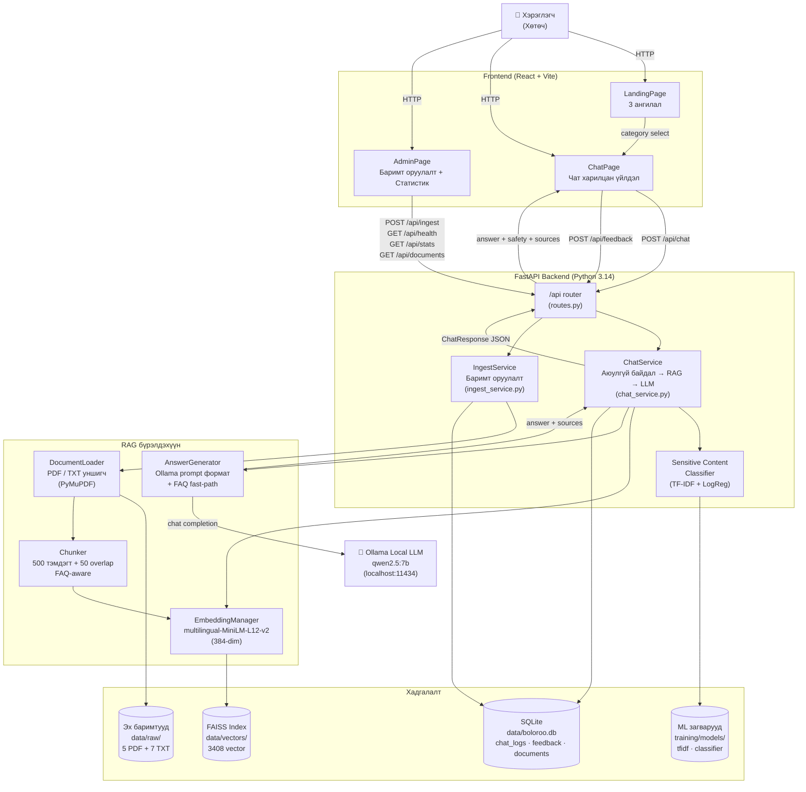

# Зураг 1. Системийн Ерөнхий Архитектур

## Mermaid диаграм

## Тайлбар

Boloroo (Тэгшбот) системийн архитектур нь хэрэглэгч-frontend-backend гэсэн классик 3-давхар бүтэцтэй. **Frontend** (React + Vite) хэрэглэгчийн үйлдлийг хүлээн авч HTTP хүсэлтээр **FastAPI backend**-руу дамжуулна. Backend дотор RAG pipeline ба safety classifier хоёр гол бүрэлдэхүүн зэрэгцэн ажиллана. RAG нь FAISS вектор индексд хайлт хийж, олдсон контекстийг **локалаар ажилладаг Ollama LLM (qwen2.5:7b)**-руу дамжуулан хариулт үүсгэдэг. Classifier нь хэрэглэгчийн оруулсан текстийг 5 ангилал (`safe`, `hate_speech`, `harassment`, `discrimination`, `self_harm`) дунд урьдчилан шалган, аюултай оролтыг шууд блоклож хариу буцаана.

Чухал шинж чанар нь **бүх зүйл локал орчинд ажилладаг** — гадаад API, OpenAI, cloud үйлчилгээ ашигладаггүй. Энэ нь хувийн өгөгдөл хамгаалал, Монгол хэрэглэгчийн интернэтийн хязгаарлалт, дипломын ажлын төсөвт нийцтэй.

## Дипломын тайланд ашиглах тайлбар

Дипломын ажлын *«Системийн архитектур»* бүлэгт уг диаграм нь системийн модульчлал, давхар-бүтэц, болон гадаад/дотоод дамжуулалтыг харуулна. Архитектур нь *«clean separation of concerns»* зарчмыг баримталсан — UI давхарга, API давхарга, business logic (services), retrieval logic (rag/), persistence (FAISS + SQLite + загварын pickle файл) нь бүгд тусгаар. Энэ нь модульчлал, тестлэгдэх чадвар, дараа сайжруулах боломжийг хадгалдаг.

Системийн гол **онцлог технологиуд:**
- **FastAPI** нь async дэмжлэг, автоматаар OpenAPI баримт үүсгэх, Pydantic-аар оролтын баталгаажуулалт хийдэг.
- **FAISS** нь Facebook-ийн нээлттэй эх вектор индекс — тусгай сервер шаарддаггүй, файл хэлбэрээр хадгалагддаг.
- **sentence-transformers/paraphrase-multilingual-MiniLM-L12-v2** нь 50+ хэлийг дэмждэг бөгөөд Монгол кирилл текстэд тохиромжтой.
- **Ollama** нь локалаар LLM ажиллуулдаг хөнгөн server — хэрэглэгчийн нууц өгөгдөл гадагш гарахгүй.

## Хамгаалалтын үеэр тайлбарлах богино хувилбар

«Систем 3 давхараас бүрдэнэ — React frontend, FastAPI backend, локал Ollama LLM. Backend нь RAG (FAISS-аар вектор хайлт) болон custom-тэй TF-IDF classifier хосолно. Хэрэглэгч асуулт оруулахад эхлээд classifier шалгаж, дараа FAISS-аас хамгийн ойролцоо chunk-уудыг олж, тэдгээрийг Ollama-руу дамжуулан Монгол хэлээр хариулт үүсгэнэ. Бүх зүйл локал, гадаад API үгүй.»
