# Зураг 2. RAG Дамжуулалтын Урсгал

## Mermaid диаграм

```mermaid
flowchart LR
    subgraph Ingestion ["Indexing үе шат (offline)"]
        direction TB
        Doc["📄 Баримт бичиг<br/>(PDF / TXT)"]
        Extract["Текст гаргалт<br/>PyMuPDF"]
        Clean["Цэвэрлэгээ<br/>хоосон зай · мөр таслалт<br/>· hyphen"]
        Detect{"FAQ хэлбэр<br/>мөн үү?"}
        ChunkFAQ["FAQ chunking<br/>1 chunk = 1 Q+A"]
        ChunkChar["Char-level chunking<br/>chunk_size=500<br/>overlap=50"]
        Embed["Embedding үүсгэх<br/>multilingual-MiniLM<br/>(384-dim, normalized)"]
        Store["FAISS Index<br/>(IndexFlatIP)<br/>+ chunks.pkl"]
    end

    subgraph Query ["Query үе шат (online)"]
        direction TB
        Q["❓ Хэрэглэгчийн<br/>асуулт"]
        Cat["Category prefix нэмэх<br/>(_CATEGORY_CONTEXT)"]
        QEmbed["Query embedding<br/>(384-dim, normalized)"]
        Search["Cosine similarity search<br/>(inner product)"]
        Rerank["Re-rank<br/>FAQ boost +0.12"]
        Filter["similarity_threshold ≥ 0.3"]
        Top["Top-k=2 chunk"]
    end

    subgraph Generate ["Хариулт үүсгэх"]
        direction TB
        Faq{"Top chunk = FAQ<br/>and score ≥ 0.55?"}
        Direct["FAQ Хариулт-ыг шууд<br/>буцаах<br/>(LLM-г тойрно)"]
        Build["Prompt бэлтгэх<br/>System + Context + Query"]
        LLM["🤖 Ollama qwen2.5:7b<br/>temperature=0.15<br/>num_predict=250"]
        Postprocess["Post-process<br/>citation header хасах<br/>· raw-snippet leak шалгах"]
        Final["✅ Эцсийн хариулт<br/>+ source citations"]
    end

    Doc --> Extract --> Clean --> Detect
    Detect -->|"тийм"| ChunkFAQ
    Detect -->|"үгүй"| ChunkChar
    ChunkFAQ --> Embed
    ChunkChar --> Embed
    Embed --> Store

    Q --> Cat --> QEmbed --> Search
    Store -.->|"индекс уншина"| Search
    Search --> Rerank --> Filter --> Top --> Faq
    Faq -->|"тийм"| Direct
    Faq -->|"үгүй"| Build
    Build --> LLM --> Postprocess --> Final
    Direct --> Final
```

## Тайлбар

RAG (Retrieval-Augmented Generation) дамжуулалтын зорилго нь LLM-ийн hallucination (зохиосон мэдээлэл) бууруулах, хариултыг бодит эх сурвалжид тулгуурлан үндэслэлтэй болгох явдал. Boloroo системийн RAG урсгал нь хоёр үе шаттай:

1. **Indexing үе шат (offline)** — баримт бичгүүдийг текст хэлбэрт хувиргаж, chunk-уудад хуваан, embedding үүсгэж, FAISS индекст хадгална. Энэ үе шатыг `scripts/ingest.py`-аар нэг удаа гүйцэтгэнэ. Чухал шинж чанар нь **FAQ-aware chunking**: `### FAQ N` болон `Асуулт:` / `Хариулт:` хэлбэрийн файлуудыг entry бүрээр нь нэг chunk болгон хадгалж, embedding-ийг зөвхөн **асуулт**-ын текстээс үүсгэдэг (хариулт нь `metadata`-д хадгалагдана).

2. **Query үе шат (online)** — хэрэглэгчийн асуулт орж ирэхэд category prefix нэмж (`_CATEGORY_CONTEXT`), embedding үүсгэн, FAISS-аас cosine similarity-ээр хайлт хийнэ. FAQ chunk-уудад +0.12 score boost өгөн re-rank хийдэг. Хэрэв top chunk нь FAQ бөгөөд score ≥ 0.55 бол **LLM-г бүр огт тойрч**, FAQ-ийн хариултыг шууд буцаана. Эс бөгөөс Ollama-руу system prompt + context + query-г илгээн Монгол хэлээр 2-4 өгүүлбэрт хариулт үүсгэдэг.

## Дипломын тайланд ашиглах тайлбар

RAG бол орчин үеийн чатбот системийн «алтан стандарт» юм. Pure-LLM хандлага нь үнэн зөв мэдээлэл өгөх баталгаагүй, hallucination өндөр. RAG нь vector retrieval ашиглан **гадаад знаниг (external knowledge)** загварт түр хугацаагаар оруулдаг. Уг диаграм нь:

- **Семантик хайлт (semantic search)**-ыг key-word match-аас илүү гэдгийг харуулна. «Хүйсийн тэгш байдал юу гэсэн үг вэ?» гэсэн query нь «жендэрийн эрх» гэсэн өгүүлбэрт байгаа chunk-тай таарна — шууд үгийн давхцал байхгүй боловч utga ойролцоо.
- **FAQ fast-path** инноваци — энэ бол стандарт RAG-аас давсан, **системийн өвөрмөц шинж**: FAQ-ийн хариултыг LLM-р дамжуулах нь шаардлагагүй, шууд буцаахад хариу хурдан, хүний бичсэнтэй адилхан цэвэр болдог.
- **Cosine similarity (IndexFlatIP normalized)** — `0.949` гэсэн score нь L2 хэмжээгээр normalize хийгдсэн вектор хоорондын inner product юм. Энэ нь cosine similarity-тэй адил.

Дипломын ажилд RAG-ийн **тоон үнэлгээ** хийх нь зүйтэй:
- Recall@k (top-k чухал chunk дотор зөв chunk байгаа эсэх)
- Precision@k (буцаасан chunk-уудын чухал нь)
- Answer faithfulness (LLM хариулт чухал chunk-аас гарсан эсэх)
- Latency (хариу үүсгэх дундаж хугацаа)

## Хамгаалалтын үеэр тайлбарлах богино хувилбар

«RAG бол LLM дээр гадаад мэдлэг нэмж бодит мэдээлэл, эх сурвалжтай хариулт өгөх арга. Манай систем нь баримт бичгүүдийг 500-тэмдэгтийн chunk-д хувааж, multilingual MiniLM-р embedding үүсгэн FAISS-д хадгалдаг. Хэрэглэгчийн асуулт ороход semantic search хийж top-2 chunk-ыг олж, Ollama-руу дамжуулдаг. FAQ chunk бол score-оос хамаараад LLM-г огт тойрч, шууд хариу буцаадаг fast-path тохиргоотой.»
