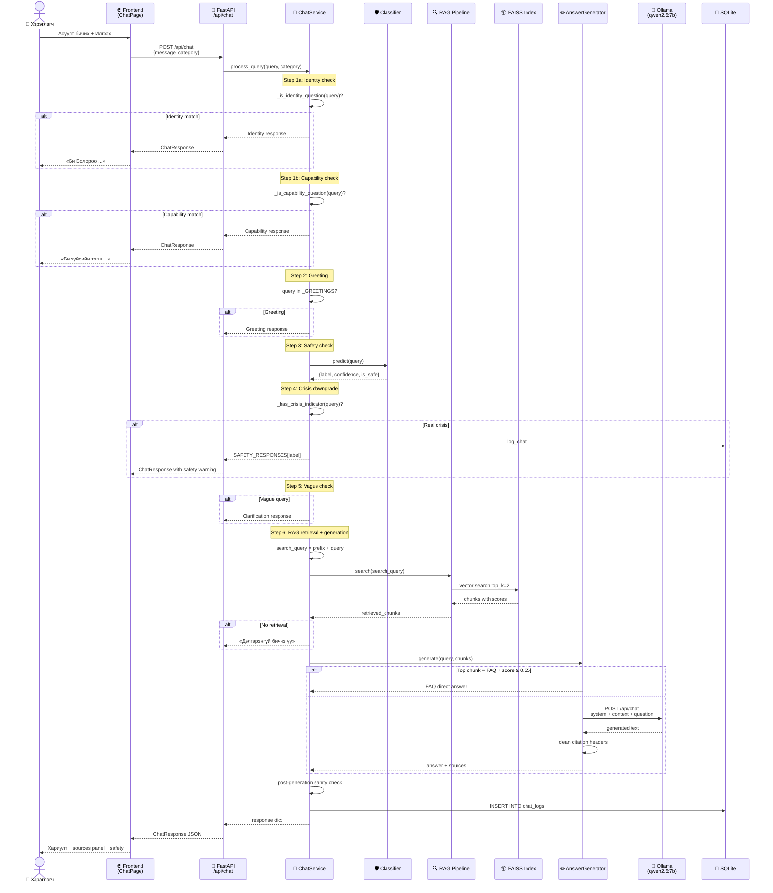

# Зураг 3. Чат Хүсэлтийн Дарааллын Диаграм (Sequence)

## Mermaid диаграм

## Тайлбар

Чат хүсэлтийн дараалал нь Boloroo системийн **бүх routing logic**-ийг харуулна. Хэрэглэгчээс асуулт орж ирэхэд `ChatService.process_query()` нь дараалласан 6 шалгуурыг гүйцэтгэдэг:

1. **Identity shortcut** — «чи хэн бэ» гэх мэт өөрийг танилцуулах асуултад RAG/LLM-г огт ашиглахгүй шууд хариулна.
2. **Capability shortcut** — «чи юу хийж чадах вэ» гэх мэт өөрийн чадварын тухай асуултад мөн шууд хариулна. Энэ нь сурсан classifier «туслаач» гэх мэт үгийг crisis гэж андуурахаас сэргийлдэг.
3. **Greeting shortcut** — «сайн уу» зэрэгт LLM-ийн нөөц зарцуулахгүй шууд мэндчилгээ өгнө.
4. **Safety classification** — TF-IDF + LogReg classifier 5 ангилалд шалгана. `self_harm` эсвэл `harassment` гэж тэмдэглэгдэвч **бодит хямралын үг (`_CRISIS_INDICATORS_RE`) байхгүй бол safe-руу буцаах downgrade** хийдэг — false positive-ыг бууруулах ухаалаг механизм.
5. **Vague query shortcut** — «яах вэ?», «хэрхэн?» зэрэгт тодруулах асуулт буцаана.
6. **RAG retrieval + LLM** — FAISS-аас top-2 chunk олж, Ollama-руу дамжуулна. Top chunk нь FAQ бөгөөд score өндөр бол **LLM-г огт тойрно**.

Бүх алхамын төгсгөлд `chat_logs` хүснэгтэд логлогддог.

## Дипломын тайланд ашиглах тайлбар

Энэ диаграм нь системийн **гүйцэтгэлийн оптимизацийг** харуулна. RAG системд тулгардаг гол асуудал бол **бүх асуултыг LLM-руу зориулахад** хариу хугацаа удаашрах юм (CPU дээр Ollama-р хариулт үүсгэхэд 5–30 секунд). Тиймээс энэ систем нь **early-exit shortcuts** ашиглаж:

- Identity / Capability / Greeting асуулт **миллисекунд хүртэл хурдан хариулагдана** (regex match → static text).
- FAQ-ийн өндөр-similarity хариултууд **LLM-г бүр алгасна**.
- Зөвхөн жинхэнэ агуулгат асуулт LLM-р дамжина.

Энэ нь **CPU-only laptop орчинд хэрэглэгчийн UX**-ийг сайжруулдаг практик инноваци бөгөөд дипломын ажлын **system design-ын ухаалаг шийдэл** болж тайлагнах боломжтой.

Бас **safety pipeline**-ийн дараалал нь чухал: classifier-ийн urьдчилсан шалгалт RAG-аас өмнө хийгдэнэ. Ингэснээр аюултай оролт vector store-ыг бохирлодоггүй, нөөц цаг алдагддаггүй.

## Хамгаалалтын үеэр тайлбарлах богино хувилбар

«Хэрэглэгч асуулт илгээхэд систем 6 шалгуураар дамжина: identity → capability → greeting → safety classifier → vague query → RAG+LLM. Эхний 3 нь LLM-г огт ашиглахгүй, шууд хариулдаг. Classifier нь аюултай оролтыг блоклох ба self_harm гэж тэмдэглэгдсэн боловч жинхэнэ хямралын үг байхгүй бол safe гэж тооцох ухаалаг downgrade хийдэг. RAG алхамд FAISS-аас top-2 chunk олоод, FAQ бол шууд хариу буцаах эсвэл Ollama руу прoмпт явуулна. Бүх харилцан үйлдэл SQLite-д logloгдож хэрэглэгчийн thumbs up/down feedback-ыг бичдэг.»
