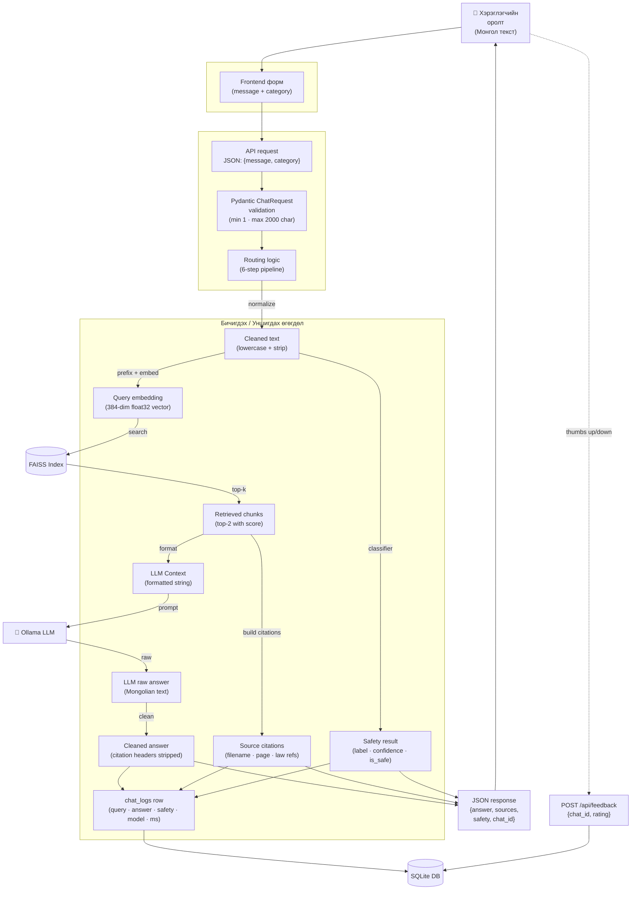

# Зураг 5. Өгөгдлийн Урсгал (Data Flow Diagram)

## Mermaid диаграм

## Тайлбар

Энэхүү data flow diagram нь **нэг асуултын мөчлөгийн өгөгдөл хэрхэн хувирч буйг** дагалздаг:

1. **Хэрэглэгчээс орох оролт** — Монгол хэлээр бичигдсэн текст (макс 2000 тэмдэгт). Frontend `message` болон сонгосон `category`-г JSON хэлбэрээр илгээнэ.
2. **Pydantic validation** — request body нь `ChatRequest` schema-д тохирч байгаа эсэхийг шалгана.
3. **Текст нормалчлал** — lowercase, whitespace strip, punctuation хасалт.
4. **Хоёр зэрэгцээ боловсруулалт:**
   - **Classifier** замаар: cleaned text → TF-IDF features → predict label, confidence.
   - **RAG** замаар: category prefix нэмж → embedding (384-dim float32) → FAISS search → top-2 chunks.
5. **LLM-руу дамжуулалт** — retrieved chunks-ыг numbered context болгож (truncated to 250 char), system prompt + user message хэлбэрээр Ollama-руу POST request.
6. **Хариулт боловсруулалт** — LLM хариуны эхэнд орж болох «[1] file.pdf (х.3)» гэх мэт citation header хасах.
7. **Citation үүсгэх** — chunks-аас law-reference (regex) гаргаж frontend-руу буцаах.
8. **Logging** — chat_logs хүснэгтэд нийт мэдээллийг хадгална: query, answer, sources_json, safety_label, safety_confidence, model_used, tokens_used, response_time_ms.
9. **Хэрэглэгчийн санал** — thumbs up/down → `feedback` хүснэгтэд `chat_id`-аар холбогдон хадгалагдана.

## Дипломын тайланд ашиглах тайлбар

Data flow diagram нь дипломын ажилд **«Системийн боловсруулалт»** бүлэгт орох ёстой. Энэ нь:

- **Өгөгдлийн төлөв (data state)** — текст → embedding → vector → chunks → LLM context → cleaned answer.
- **Тэмдэгт format-ийн өөрчлөлт** — JSON request → Pydantic object → numpy array → FAISS query → list of dicts → LLM prompt string → LLM response → JSON response.
- **Persistence layer-ын role** — FAISS бол vector хайлтад зориулсан, SQLite бол structured метадата ба чат түүхэд зориулсан гэдгийг тодорхой ялгаж харуулна.

**Дипломын ач холбогдол:** RAG системийн «нөөцтэй» цэгүүдийг харуулна:
- LLM call (хамгийн удаан, 5–30s)
- FAISS search (миллисекунд)
- Classifier predict (миллисекунд)
- DB write (миллисекунд)

Үүний улмаас FAQ fast-path-ыг яагаад нэмсэн нь логиктой болно.

**Privacy-ийн талаас:** хэрэглэгчийн query текст SQLite-д хадгалагддаг боловч **хэрэглэгчийн ID, IP, нэр огт хадгалагддаггүй** — буюу анонимтай. Энэ нь GDPR-style requirement-уудтай нийцэх боломжтой.

## Хамгаалалтын үеэр тайлбарлах богино хувилбар

«Хэрэглэгчийн Монгол текст оролт нь Pydantic-аар баталгаажиж, lowercase нормалчлагдан 2 зэрэгцээ замаар явдаг: TF-IDF classifier-руу аюулгүй байдал шалгуулах ба multilingual MiniLM-р embedding үүсгэн FAISS-аас top-2 chunk хайх. Олдсон chunk-ууд Ollama prompt-д орж хариулт үүсгэдэг. Хариулт нь cleaning algorithm-аар citation leak-ыг хасуулсны дараа SQLite-д лог хадгалагдан, JSON хэлбэрээр frontend-руу буцдаг.»
