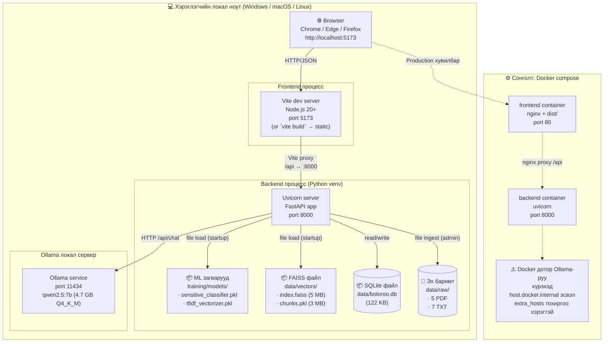

# Зураг 6. Деплой Диаграм (Deployment Diagram)

## Mermaid диаграм

## Тайлбар

Boloroo нь **бүхэлдээ локал орчинд ажиллах зохиогдсон систем** юм — хэрэглэгчийн ноут эсвэл дотоод сервер дээр бүх бүрэлдэхүүн ажиллана. Энэ нь:

- **Хувийн өгөгдөл хамгаалал** — хэрэглэгчийн асуулт internet-руу гардаггүй.
- **Татвар, лиценз байхгүй** — Ollama, FAISS, sentence-transformers, scikit-learn, FastAPI бүгд нээлттэй эх.
- **Боломжийн хязгаарлалттай** — CPU laptop-д LLM хариу үүсгэх хугацаа удаан (5-30s), GPU-тай машинд илүү хурдан.

**3 параллел процесс** хамтран ажиллана:
1. **Vite (port 5173)** — Frontend dev сервер. Production-д энэ нь nginx + static dist/ хэлбэртэй.
2. **Uvicorn (port 8000)** — FastAPI backend. Startup-д бүх загвар, FAISS индексийг RAM-д ачаална.
3. **Ollama (port 11434)** — LLM серверл. Тусдаа процесс гэдгийг ялгуу анхаарах хэрэгтэй — **demo хийхээс өмнө хүн `ollama serve` ажиллуулсан байх ёстой**.

**Файлын persistence:**
- `data/vectors/index.faiss` — FAISS indexFlat бэлдсэн файл.
- `data/vectors/chunks.pkl` — chunk metadata pickle.
- `data/boloroo.db` — SQLite (chat_logs, feedback, documents, chunks).
- `training/models/*.pkl` — TF-IDF vectorizer + LogReg classifier.
- `data/raw/*` — анхны эх баримт (PDF/TXT).

**Docker сонголт:**
`docker-compose.yml` нь backend + frontend container-уудыг үүсгэдэг боловч Ollama-г agtaadaggүй (хост машин дээр ажиллах ёстой). Container дотроос `localhost:11434` нь container-ын өөрийн localhost-руу заана — хост Ollama-руу хүрэхгүй. **Засвар:** `OLLAMA_BASE_URL=http://host.docker.internal:11434` гэж .env-д тохируулах.

## Дипломын тайланд ашиглах тайлбар

Deployment diagram нь дипломын ажилд **«Системийн ажиллагаа орчин»**, **«Технологи сонголтын үндэслэл»** бүлэгт орно.

**Гол үндэслэлүүд:**

- **Локал-only архитектур** — Монгол улсын вузын дипломын ажилд cloud зардал шаардсагүй, demo-г аль ч ноут-буукт хийх боломжтой.
- **Process separation** — frontend/backend/LLM 3 процесс нь scaling, өөрчлөгдөх боломжтой. LLM-г өөр машинд шилжүүлсэнгүй гэхэд `OLLAMA_BASE_URL`-ыг өөрчилөхөд хангалттай.
- **File-based persistence** — Postgres/MongoDB шаарддаггүй, SQLite + FAISS файл хэлбэрээр backup, version control хялбар.
- **Memory footprint** — Ollama 4.7 GB + sentence-transformer 470 MB + FAISS 5 MB + SQLite 0.1 MB ≈ **5–6 GB RAM** шаардлагатай. 16 GB ноут буукт асуудалгүй.

**Production-readiness үнэлгээ:**
- ✅ Локал demo-д бэлэн.
- ⚠️ Docker compose цэгцрэх хэрэгтэй (Ollama URL).
- ❌ Олон хэрэглэгчид (multi-tenant) тохирохгүй — нэг FAISS index, нэг SQLite, нэг Ollama instance.
- ❌ Horizontal scaling хийх загвар байхгүй (загвар state-stateful).

**Хамгийн чухал ноут:** Хамгаалалтын өдөр **Ollama сервер заавал ажиллаж байх ёстой**. Pre-flight script (`scripts/check_demo.py`)-р шалгахыг зөвлөж байна.

## Хамгаалалтын үеэр тайлбарлах богино хувилбар

«Систем нь хэрэглэгчийн нэг ноут буукт бүхэлдээ ажилладаг — гадаад API, cloud үйлчилгээ үгүй. 3 локал процесс ажиллана: Vite frontend (5173), Uvicorn backend (8000), Ollama LLM (11434). Backend startup үед FAISS индекс, ML загварыг RAM-руу ачаалдаг. Бүх өгөгдөл локал файлууд (FAISS .faiss, SQLite .db, pickle загвар) хэлбэрээр хадгалагддаг. Docker compose сонголт байгаа боловч Ollama хост-аас хамаарна.»
