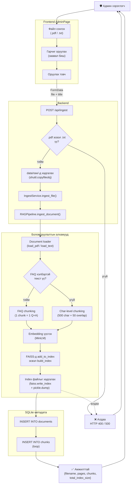

# Зураг 7. Админ Баримт Бичиг Оруулах Урсгал

## Mermaid диаграм

## Тайлбар

Энэ диаграм нь **админ хэрэглэгч баримт бичиг оруулах** үед системийн доторх боловсруулалтын дарааллыг харуулна:

1. **Frontend дээр** — админ файл сонгож, заавал биш гарчиг оруулж, «Оруулах» товч дарна. Frontend `multipart/form-data` хэлбэрээр `POST /api/ingest`-д илгээнэ.
2. **Backend validation** — `.pdf` эсвэл `.txt` биш бол HTTP 400 буцаана. Бусад format (.docx, .html гэх мэт)-ыг одоогоор дэмжихгүй.
3. **Файлыг disk-д хадгалах** — `data/raw/<filename>` зам руу copyfileobj-аар бичнэ.
4. **`IngestService.ingest_file()` дуудалт:**
   - `RAGPipeline.ingest_document(file_path)`-г дуудна.
   - Дуусахад chunk count, page count буцаана.
5. **RAGPipeline дотор:**
   - `load_document` нь PDF бол PyMuPDF-аар хуудас тус бүрээр текст гаргана; TXT бол UTF-8 уншина.
   - Текст цэвэрлэгдэн (whitespace, hyphen, line break) `DocumentPage` хэлбэрт буурна.
   - **FAQ detection** — `### FAQ N` болон `Асуулт:` / `Хариулт:` хэлбэр илрэх эсэхийг шалгана.
   - FAQ бол **entry бүрээр нь нэг chunk** хадгална (`is_faq=True` метадата). Эс бөгөөс char-level chunking (500 chars + 50 overlap, sentence-boundary-aware).
   - sentence-transformers-аар embedding үүсгэн (FAQ chunk-ийн хувьд **зөвхөн асуултын текстээс**) FAISS-д нэмнэ.
   - Index болон chunks pickle файлыг disk-д хадгална.
6. **SQLite метадата** — `documents` хүснэгтэд document мөр нэмж, `chunks` хүснэгтэд тус бүрийн chunk-уудыг (`document_id`-аар foreign key хамаарал) бичнэ.
7. **Хариу буцаалт** — `IngestResponse(filename, pages, chunks, total_index_size)` JSON.

## Дипломын тайланд ашиглах тайлбар

Энэхүү flow нь дипломын ажилд **«Knowledge Base Management»** буюу мэдлэгийн санг шинэчлэх процессыг харуулна. Гол ач холбогдол:

- **Динамик мэдлэгийн сан** — систем зөвхөн анхны seed data-д хязгаарлагдахгүй; админ шинэ хууль, гарын авлага, FAQ нэмэх боломжтой.
- **Идэмпотент бичилт** — `INSERT OR REPLACE` хэрэглэдэг тул нэг файлыг хоёр удаа upload хийсэн ч анхны index байдалд эргүүлдэг (хэдийгээр FAISS-д шинэ vector нэмэгдэж байгаа нь түгээмэл асуудал — алгасч засах).
- **FAQ-aware ingestion** — Q+A pair-уудыг бүтнээр хадгалах нь retrieval чанарт ихээхэн нөлөөтэй. Дипломын ажилд *«chunking strategy-ийн чанарын харьцуулалт»* гэдэг туршилтыг хийх боломжтой (наивная character chunking vs FAQ-aware chunking).
- **Persistence атомик биш** — FAISS файл бичигдсэний дараа SQL бичилт алдаа гарвал зөрчил үүсэх магадлалтай. Дипломын ажилд *«future improvement»* хэсэгт «transactional ingestion» гэж тэмдэглэх хэрэгтэй.

**Одоогоор олдсон хэрэгцээтэй сайжруулалт:**
- `scripts/ingest.py` нь bulk ingestion хийдэг боловч SQLite-д бичдэггүй. Үүний улмаас одоо систем дотор FAISS-3408 vector vs SQL-0 row зөрчил бий (DIPLOMA_AUDIT_MN.md, FIX_PLAN_MN.md дээр дэлгэрэнгүй).

## Хамгаалалтын үеэр тайлбарлах богино хувилбар

«Админ хуудсаар PDF/TXT файл оруулахад backend нь файлыг сторагт хадгалж, RAGPipeline-руу дамжуулна. Тэр нь PDF-ийг PyMuPDF-аар уншиж, FAQ хэлбэрийг автоматаар таних — FAQ бол entry бүрээр нэг chunk, эс бөгөөс 500 тэмдэгтийн overlap-тай chunk үүсгэдэг. Embedding-ыг multilingual MiniLM-р үүсгэн FAISS index-д add хийж, index болон chunks.pkl-ыг disk-д бичнэ. SQLite-д баримт ба chunk-ын метадата тус бүр row-р бичигдэнэ.»
