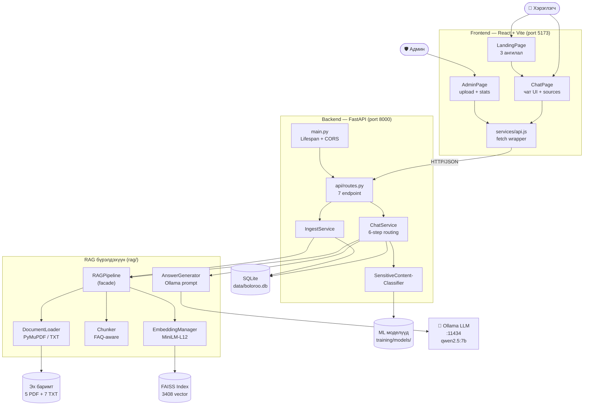

# 3.1 Системийн ерөнхий архитектур

> **Зураг 3.1.** Системийн ерөнхий архитектур.
> Эх сурвалж файлууд: `backend/app/main.py`, `backend/app/api/routes.py`, `backend/app/services/chat_service.py`, `rag/pipeline.py`, `rag/embeddings.py`, `rag/generator.py`, `training/scripts/inference.py`, `frontend/src/App.jsx`, `frontend/src/services/api.js`, `vite.config.js`, `.env`.
> Source: `docs/diagrams/source/01_system_architecture.puml` · `docs/diagrams/source/01_system_architecture.mmd`
> Rendered: `docs/diagrams/rendered/01_system_architecture.png` (хэрэв rendering хийгдсэн бол)

## Диаграм

## Тайлбар

Boloroo (UI бранд: «Тэгшбот») чатбот системийн архитектур нь **гурван үндсэн давхрагатай**: хэрэглэгчтэй харилцах *frontend*, бизнес-логик гүйцэтгэх *backend*, болон туслах *гадаад үйлчилгээнүүд* (Ollama LLM, FAISS вектор индекс, ML загварын файлууд). Энэхүү давхар-бүтэц нь *separation of concerns* зарчмыг баримталж, бүрэлдэхүүн бүрийг бие даан тестлэх, өөрчлөх, өргөтгөх боломжийг хадгалдаг.

**Frontend** нь React 18.3 болон Vite 5.4 ашиглан бүтсэн single-page application бөгөөд `LandingPage`, `ChatPage`, `AdminPage` гэсэн гурван үндсэн хуудсыг агуулна. Хэрэглэгчтэй харьцах бүх HTTP холбоог `services/api.js` доторх 6 fetch wrapper функцээр гүйцэтгэдэг. Vite-ийн dev-серверийн `proxy` тохиргоогоор `/api/*` зам нь `http://localhost:8000`-руу шилжин хүрнэ.

**Backend** нь FastAPI хүрээн дээр Pydantic-ийн оролт-баталгаажуулалт, async dispatch болон ASGI lifespan-ыг ашиглан зохион байгуулагдсан. `main.py` дотор `lifespan` context manager-ийн тусламжтайгаар startup үед SQLite базыг нээж, FAISS индексийг RAM руу ачаалж, custom-сургагдсан Sensitive Content Classifier-ыг бэлтгэж, эдгээрийг `ChatService` ба `IngestService` рүү тарьдаг. Энэхүү бэлдлэгийн дараа л `routes.py` доторх 7 endpoint бэлэн болно.

**RAG (Retrieval-Augmented Generation) бүрэлдэхүүн** нь backend-ээс тусдаа модуль (`rag/`) болж зохиогдсон. Энэ модулийг тогтооход төв facade нь `RAGPipeline` бөгөөд `DocumentLoader`, `Chunker`, `EmbeddingManager`, `AnswerGenerator` гэсэн 4 туслах ангиа бие биенээсээ ялган координат хийнэ. Энэхүү бүтэц нь дараах ач холбогдолтой:

1. **Ingestion болон retrieval нь LLM-ээс тусгаар** ажиллана. Тиймээс эх баримт оруулах процесс нь Ollama сервергүйгээр гүйцэтгэгдэх боломжтой.
2. **Bottleneck-ыг бууруулдаг** — embedding нь `EmbeddingManager`-т, generation нь `AnswerGenerator`-т хариуцагдсан, аль нэгийг өөрчлөхөд бусдад нөлөөлөхгүй.
3. **Тестлэгдэх боломж** — bod LLM ашиглахгүйгээр FAISS retrieval-ыг unit-тестлэх боломжтой.

**Гадаад үйлчилгээ Ollama** нь хэрэглэгчийн локал машин дээр (`localhost:11434`) `qwen2.5:7b` загварыг 4-битийн квантизац (Q4_K_M, 4.7 GB)-аар ачаалан ажиллана. `AnswerGenerator` нь HTTP-ээр Ollama-руу `POST /api/chat` хүсэлт явуулж, retrieved context болон system prompt-ыг хосолсон Mongolian-only prompt бэлдэж дамжуулдаг.

**Хадгалалтын давхарга** нь дөрвөн төрлийн файлд хуваагдана: SQLite (`data/boloroo.db`)-д бүтэц мэдээлэл (`documents`, `chunks`, `chat_logs`, `feedback`), FAISS (`data/vectors/`)-т векторууд, scikit-learn pickle (`training/models/`)-т ML загварууд, текстийн эх баримт (`data/raw/`)-т 5 PDF болон 7 TXT файл хадгалагдана.

## Дипломын ажилд оруулах тайлбар

Уг диаграм нь дипломын ажлын *«3.1 Системийн ерөнхий архитектур»* хэсэгт орох ёстой. Энэ нь системийн **технологийн стек, давхарга-зохион байгуулалт, мэдээллийн хөдөлгөөний ерөнхий шугам**-ыг харуулдаг учир уншигч (комисс) системийн ерөнхий зургийг хамгийн түрүүнд шингээх боломжтой.

Архитектурын гол шинж чанарууд нь дараах гурван дипломын-академик үнэлэлттэй:

1. **Locally-deployable RAG** — гадаад API ашиглахгүй (Ollama локал, FAISS локал, classifier локал). Энэ нь нууц өгөгдлийг хамгаалах, татвар, лицензийн зардал шаарддаггүй, demo-г ямар ч ноут буукт ажиллуулж болох гэдгийг харуулна.
2. **Service-oriented internal layering** — `api/routes.py` (controller) → `services/*` (business logic) → `rag/*` (retrieval-generation) → persistence. Энэ нь *clean architecture*-ийн зарчимтай нийцэнэ.
3. **Decoupled retrieval and generation** — `RAGPipeline.search()` ба `AnswerGenerator.generate()` хоёр нь бие даан гүйцэтгэгдэх боломжтой, ингэснээр FAQ fast-path болон Ollama-гүй fallback зэрэг оптимизаци хэрэгжих орон зайтай.

## Хамгаалалтын үеэр товчоор тайлбарлах

«Систем нь гурван давхар архитектуртай. Frontend нь React + Vite, backend нь FastAPI, гадаад үйлчилгээ нь локал ажиллах Ollama LLM юм. Backend дотор RAG модуль болон Sensitive Content Classifier зэрэгцэн ажиллана — RAG нь FAISS-аас холбогдох баримтын chunk хайж олж, Ollama-руу Mongolian system prompt-ийн хамт явуулан хариулт үүсгэдэг бол classifier нь хэрэглэгчийн оролтыг 5 ангилалд шалган аюултай агуулгыг блокчилдог. Бүх өгөгдөл (баримт, vector index, ML загвар, чат log) хэрэглэгчийн машин дээрх локал файл, SQLite-д хадгалагдана.»
