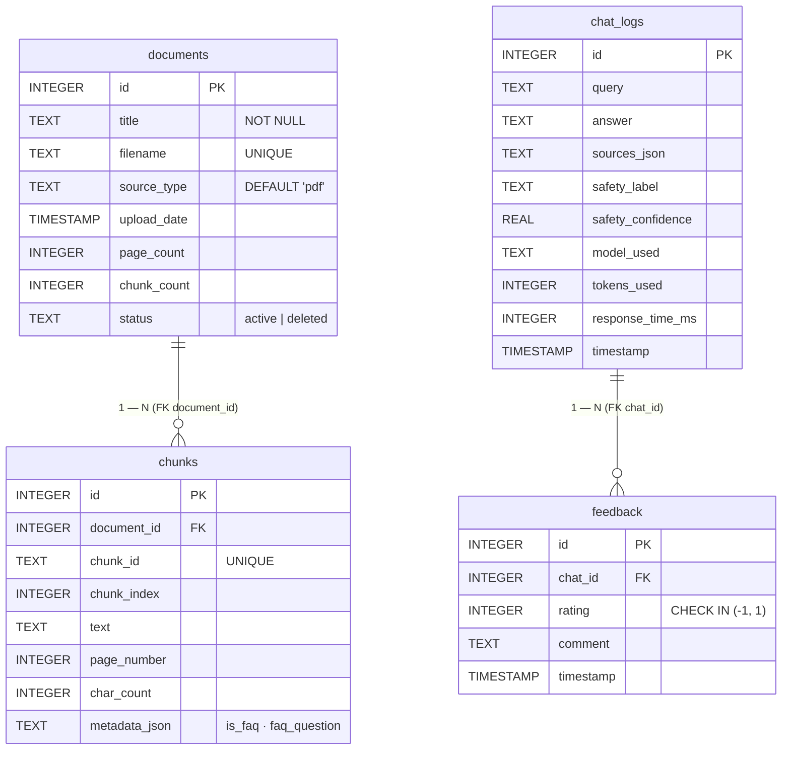

# 3.2 Өгөгдлийн ерөнхий схем (ER Diagram)

> **Зураг 3.2.** Өгөгдлийн ерөнхий схем — SQLite + FAISS гэсэн хосолсон persistence.
> Эх сурвалж файлууд: `backend/app/db/database.py:init_db()`, `backend/app/services/ingest_service.py`, `backend/app/services/chat_service.py`, `rag/chunker.py:Chunk`.
> Source: `docs/diagrams/source/02_er_diagram.puml` · `docs/diagrams/source/02_er_diagram.mmd`
> Rendered: `docs/diagrams/rendered/02_er_diagram.png`

## Диаграм

## Тайлбар

Boloroo системийн өгөгдлийн загвар нь хоёр төрлийн хадгалалттай: **structured метадата SQLite-д**, **vector өгөгдөл FAISS файлд**. SQLite дотор **дөрвөн хүснэгт** бий бөгөөд тэдгээрийн DDL-ийг `backend/app/db/database.py:init_db()`-д тодорхойлсон. Бүх хүснэгт нь WAL-режимд (Write-Ahead Logging) ажиллаж, нэгэн зэрэг олон бичигч-уншигч-д тохиромжтой.

### Хүснэгт бүрийн үүрэг

**`documents`** хүснэгт нь системд оруулсан эх баримтын мета-түвшний бичлэгийг хадгална. Гол баганууд нь `filename` (давхардахгүй UNIQUE), `source_type` (`'pdf'` эсвэл `'txt'`), `page_count`, `chunk_count`. `status` баганад `'active'` эсвэл `'deleted'` гэсэн утга авдаг — soft-delete-аар баримт «устгасан» гэж тэмдэглэх боловч физикээр устгахгүй (`IngestService.delete_document()`-аар).

**`chunks`** хүснэгт нь `documents`-той `1—N` хамаарал бүхий бөгөөд RAG-ийн chunking үе шатанд үүссэн жижиг текст хэсгүүдийн метадатаг хадгална. `chunk_id` нь системийн доторх UNIQUE текст түлхүүр (жишээ нь `faq_gender_equality_txt_faq_3` эсвэл `gender_guide_p2_c0`). `metadata_json` багана нь Python `dict`-аас JSON-руу буусан агуулга бөгөөд FAQ chunk-уудын хувьд `{"is_faq": true, "faq_question": "...", "faq_answer": "..."}` түлхүүрүүдийг агуулна. Энэ нь `EmbeddingManager`-т FAQ-aware retrieval хийх үндэс юм.

**`chat_logs`** хүснэгт нь хэрэглэгчийн чат харилцан үйлдэл бүрд нэг row нэмнэ. Үүнд `query`, `answer`, `sources_json` (citation-ийн денормалчлагдсан JSON массив), classifier-ийн үр дүн (`safety_label`, `safety_confidence`), ашигласан LLM (`model_used` нь `qwen2.5:7b`, `faq_direct`, `shortcut`, `source_fallback`, `unclear_intent` зэрэг утга авна), `tokens_used`, `response_time_ms` зэрэг ажиглалтын мэдээлэл хадгалагдана. **Уг хүснэгтэд `user_id` багана байхгүй** — систем нь анонимтай учир GDPR-стиль privacy-ийн зарчимтай нийцэнэ.

**`feedback`** хүснэгт нь `chat_logs`-той `1—N` хамаарлаар холбогдсон, `rating` багана нь `CHECK IN (-1, 1)` constraint-аар *thumbs up* (1) / *thumbs down* (−1) зөвшөөрнө. Ирээдүйд хэрэглэгчийн санал-д суурилсан *active learning* хийх боломж олгоно.

### Холбоосын утга

`documents.id ←→ chunks.document_id` нь classic *master-detail* харилцаа: нэг баримт оруулахад N chunk үүсэж, нэг row-н dropdown delete хийхэд cascade хийгдэхгүй (зөвхөн `documents.status='deleted'` тэмдэглэгдэнэ). Энэ нь чат түүхийн citation-ыг сэргээх боломж хадгалдаг — устгасан баримтын chunk хүртэл `chat_logs.sources_json`-д хадгалагдсан тул хуучин чатын citation алдагдахгүй.

`chat_logs.id ←→ feedback.chat_id` хамаарал нь админ хуудсан дээр «нийт санал», «эерэг санал» гэх статистикыг гаргахад хэрэглэгдэнэ (`GET /api/stats`).

### FAISS — file-based persistence

SQLite-аас гадуур, `data/vectors/` хавтсан дотор хоёр файл байна:
- **`index.faiss`** — `faiss.IndexFlatIP` бөгөөд 384-хэмжээст float32 vector-уудыг агуулна. 3408 vector × 384 ≈ 5 MB хэмжээтэй.
- **`chunks.pkl`** — Python pickle-ээр serialize хийсэн `list[Chunk]` дотор `chunk_id`, `text`, `source_file`, `page_number`, `chunk_index`, `metadata` талбарууд хадгалагдана. Энэ нь FAISS-ийн index ID-аас эх chunk объект руу хүрэх *reverse map* юм.

`chunks.pkl` болон `chunks` SQLite хүснэгт хоёр нь **зэрэг бичигддэг** (`IngestService.ingest_file()`-р). Гэхдээ `scripts/ingest.py` нь зөвхөн pickle-ийг бичдэг, SQL-ийг бичдэггүй учир runtime mismatch үүссэн (DIPLOMA_AUDIT_MN.md дотор тэмдэглэгдсэн).

### Системд хадгалагдаж буй өгөгдлийн ангилал

| Өгөгдлийн ангилал | Хадгалалтын газар | Privacy түвшин |
|-------------------|-------------------|----------------|
| Эх баримт (PDF/TXT) | `data/raw/` | Нийтийн (хууль, гарын авлага) |
| Vector embedding | `data/vectors/` | Нийтийн |
| Чат query/answer | `chat_logs` | Анонимтай (user ID байхгүй) |
| Хэрэглэгчийн санал | `feedback` | Анонимтай |
| ML загвар | `training/models/*.pkl` | Жижиг, нээлттэй |

## Дипломын ажилд оруулах тайлбар

Уг ER диаграм нь *«3.2 Өгөгдлийн ерөнхий схем»* эсвэл *«3.2 Өгөгдлийн загвар»* хэсэгт орно. Энэ нь:

1. **Persistence-ийн хосолсон шинж чанар** — SQLite (structured) ба FAISS (vector) нэмэлт шинжтэй гэдгийг харуулдаг бөгөөд RAG системийн зайлшгүй сайн дадал юм.
2. **Анонимтай чат log** — `chat_logs`-т `user_id` байхгүй гэдэг нь privacy-friendly design гэдгийг тодорхой харуулна.
3. **Soft delete** — баримт устгахдаа физикээр устгахгүй, түүхэн citation алдагдахгүй design зарчим.
4. **Citation-ийн денормалчлал** — `chat_logs.sources_json` нь FK биш, JSON хэлбэрээр хадгалдаг. Энэ нь *trade-off design choice* юм: write нь хялбар, гэхдээ chunk текст өөрчлөгдвөл түүх хуучирна.

## Хамгаалалтын үеэр товчоор тайлбарлах

«Системд дөрвөн SQLite хүснэгт байна: documents (баримт metadata), chunks (chunking-ийн үр дүн), chat_logs (чат түүх), feedback (хэрэглэгчийн санал). documents-chunks болон chat_logs-feedback хооронд 1-N FK харилцаа бий. Чат логи нь user_id агуулдаггүй — анонимтай design. Vector өгөгдөл нь SQLite-ээс гадуур, FAISS index файл болон chunks pickle хэлбэрээр хадгалагддаг. Бичих үед SQL хүснэгт болон pickle файл зэрэг шинэчлэгддэг.»
