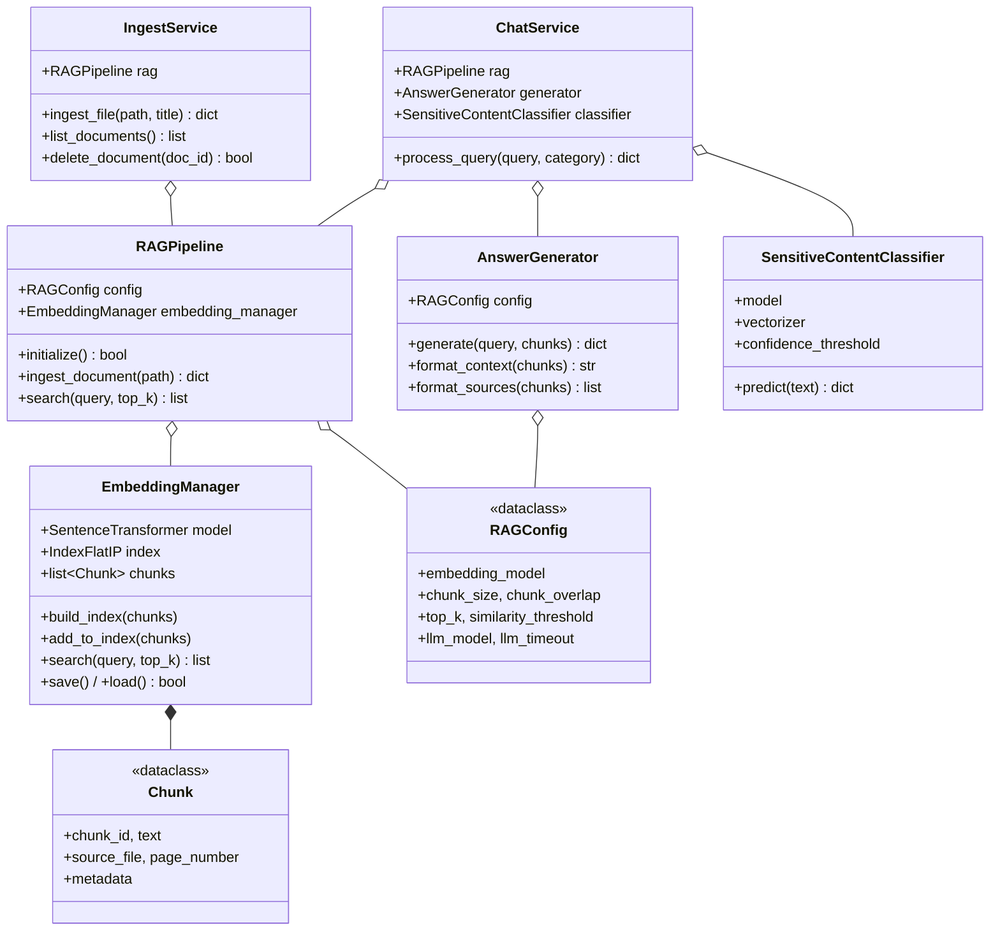

# 3.3 Класс диаграм

> **Зураг 3.3.** Класс диаграм — Boloroo системийн гол анги, тэдгээрийн хариуцлага ба харилцан хамаарал.
> Эх сурвалж файлууд: `backend/app/services/chat_service.py`, `backend/app/services/ingest_service.py`, `rag/pipeline.py`, `rag/embeddings.py`, `rag/generator.py`, `rag/chunker.py`, `rag/document_loader.py`, `rag/config.py`, `training/scripts/inference.py`, `backend/app/schemas/schemas.py`.
> Source: `docs/diagrams/source/03_class_diagram.puml` · `docs/diagrams/source/03_class_diagram.mmd`
> Rendered: `docs/diagrams/rendered/03_class_diagram.png`

## Диаграм

(Бүрэн хувилбарын Pydantic schema-ууд `docs/diagrams/source/03_class_diagram.puml`-д бий)

## Тайлбар

### Анги бүрийн хариуцлага

**`ChatService`** (`backend/app/services/chat_service.py`) — системийн **үндсэн оркестратор**. Гурван агрегат-холболттой: `RAGPipeline` (retrieval), `AnswerGenerator` (LLM), `SensitiveContentClassifier` (safety). Гол арга нь `process_query(query, category)` — 6-step routing pipeline-ыг гүйцэтгэнэ. Туслах модуль-түвшний функцууд (regex-pattern шалгах) нь *capability-question*, *identity-question*, *crisis-indicator* зэрэг шалгалтуудыг хийнэ.

**`IngestService`** (`backend/app/services/ingest_service.py`) — баримт оруулалтын мини-оркестратор. `RAGPipeline.ingest_document()`-ыг дуудаж, дараа SQLite-д metadata бичих ажлыг хариуцна. `list_documents()` ба `delete_document()` нь админ UI-аар ашиглагдана.

**`RAGPipeline`** (`rag/pipeline.py`) — retrieval-ийн **facade анги**. `EmbeddingManager`-ыг encapsulate хийж, `ingest_document()` (load → chunk → embed → save) болон `search(query)` гэсэн хоёр өндөр-түвшний интерфэйсийг танилцуулна. Үүний ачаар backend-ийн service-үүд retrieval-ийн нарийн ширийнийг мэдэхгүйгээр ажиллаж чадна.

**`EmbeddingManager`** (`rag/embeddings.py`) — энд **бүх векторын ажил** төвлөрсөн: SentenceTransformer-ийг ачаалах, `embed_texts(texts)` болон `embed_query(query)`, FAISS index-г barillah/уншиж, search хийх. `_embed_text_for_chunk(chunk)` нь FAQ-aware logic-ыг агуулна — FAQ chunk-ийн хувьд зөвхөн асуултын текстийг embedding хийдэг.

**`AnswerGenerator`** (`rag/generator.py`) — LLM-ийг прампт-аар хүсэлтэд гаргаж, хариуны хэлбэрийг боловсруулах хариуцлагатай. Гол арга `generate(query, chunks)` нь:
- FAQ fast-path шалгалт (top score ≥ 0.55).
- Ollama health check.
- `format_context()` (chunk-уудыг 250-тэмдэгт дотор тасалж дугаарлан байрлуулна).
- POST /api/chat (Ollama).
- `_clean_llm_answer()` (citation-header leak-ыг хасна).
- Timeout / connection-error / generic exception-уудад тус бүрд fallback message.

`format_sources(chunks)` нь frontend-ийн `SourcePanel` дээр харагдах SourceCitation объектуудыг үүсгэнэ — `_get_doc_title()`-ээр human-readable нэр оноох, `_extract_law_refs()`-ээр Mongolian regex-аар хууль зүйлийн дугаарыг ялгаж авах.

**`SensitiveContentClassifier`** (`training/scripts/inference.py`) — TF-IDF + Logistic Regression-ыг pickle-аас ачаалж, `predict(text)`-ээр 5-ангиллын ангилал хийнэ. `confidence_threshold=0.5`-ээс доош үед `safe`-руу буцаах сэргийлэх логиктой.

**`RAGConfig`** (`rag/config.py`) — `@dataclass` декоратортой immutable тохиргооны объект. `chunk_size=500`, `chunk_overlap=50`, `top_k=2`, `similarity_threshold=0.3`, `llm_model="qwen2.5:7b"`, `llm_timeout=90`, `system_prompt` (Mongolian-only rules) зэргийг агуулна. `RAGPipeline`, `EmbeddingManager`, `AnswerGenerator` гурвуулаа уг тохиргоог хуваалцна.

**`Chunk`** болон **`DocumentPage`** (`rag/chunker.py`, `rag/document_loader.py`) — pure data class-ууд. `Chunk` нь FAISS-руу буух нэгж, `DocumentPage` нь loader-аас гарах нэгж.

**Pydantic schema-ууд** (`backend/app/schemas/schemas.py`) — REST API-ийн оролт-гаралтын типийг тодорхойлно. `ChatRequest` нь `min_length=1, max_length=2000` constraint-той, `FeedbackRequest.rating` нь `ge=-1, le=1` constraint-той. Энэ нь автомат OpenAPI documentation үүсгэх боломжийг олгодог.

### Холбоосын утга

- **Aggregation (◇)** нь *whole-part лайфтайм бус* — жишээ нь `ChatService o-- RAGPipeline` нь ChatService уг RAGPipeline-ыг ашигладаг боловч түүний lifetime-ийг өмчилдөггүй (`main.py`-д startup-д үүсэн, дараа inject хийгдэнэ).
- **Composition (◆)** нь *whole-part lifetime ownership* — `EmbeddingManager *-- Chunk` гэдэг нь EmbeddingManager-ийн `chunks: list[Chunk]` талбарт chunk-уудын лайфтайм холбогдсон.
- **Dependency (---,>)** нь хэрэглээний харилцаа — `ChatService ..> ChatRequest : <<consumes>>`, `ChatService ..> ChatResponse : <<produces>>`.

## Дипломын ажилд оруулах тайлбар

Уг класс диаграм нь *«3.3 Класс диаграм»* эсвэл *«3.3 Объект-чиглэсэн загвар»* хэсэгт орох ёстой. Энэ нь:

1. **Single Responsibility Principle (SRP)** — анги бүр нэг тодорхой зорилготой (RAGPipeline = facade, EmbeddingManager = vector ops, AnswerGenerator = LLM).
2. **Dependency Injection** — `ChatService.initialize_with_rag(rag)` ба `IngestService(rag_pipeline)` constructor pattern-аар DI хэрэгжсэн.
3. **Configuration aggregation** — гурван анги нэг `RAGConfig`-ийг хуваалцдаг тул ажлын явц явцад тохиргоог нэг газраас өөрчилж болно.
4. **Pydantic дамжуулагч** — REST давхрагын класс (Pydantic schema) нь business class-аас зориудаар тусдаа байдаг — *anti-corruption layer* зарчим.

Уг диаграмыг диплом-академик хэв маягт оруулахад **«хариуцлага бүхий гол анги л байрлуулсан, дам-туслах анги, sklearn-ийн дотоод class зэргийг оруулаагүй»** гэсэн тайлбарыг бичих хэрэгтэй.

## Хамгаалалтын үеэр товчоор тайлбарлах

«Системийн гол анги нь `ChatService` бөгөөд RAG, classifier, generator-ыг агрегат хийн чат хүсэлт боловсруулна. RAG модуль нь `RAGPipeline` (facade), түүнийг `EmbeddingManager` (FAISS + sentence-transformer) ба `AnswerGenerator` (Ollama prompt) дэмжинэ. Тохиргоо `RAGConfig` нь dataclass хэлбэрээр гурван анги хооронд хуваалцагддаг. Ingest зам нь `IngestService` болон ижил `RAGPipeline`-ыг хуваан ашиглана. REST давхарга-нь Pydantic schema-аар оролт-гаралтыг баталгаажуулдаг.»
