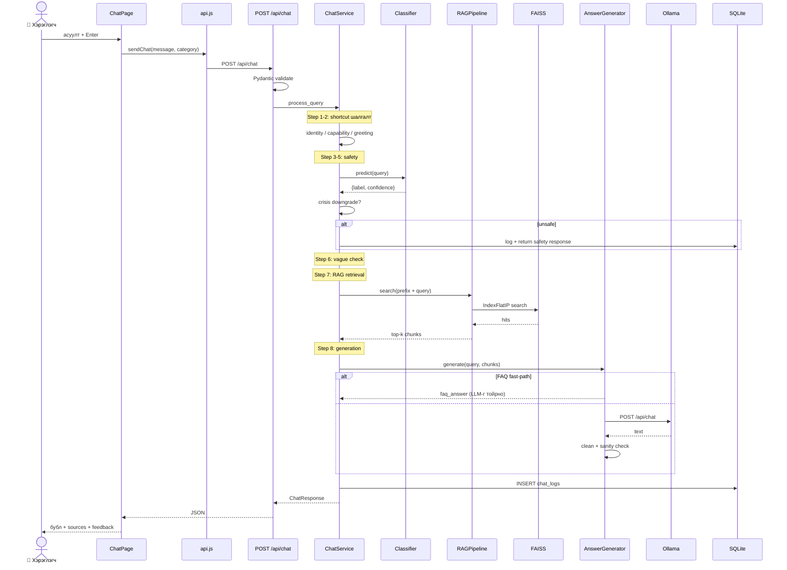

# 3.4 Хэрэглэгчийн асуултад хариулах дарааллын диаграм

> **Зураг 3.4.** Чат хүсэлтийн дотоод дараалал — 6-step routing pipeline.
> Эх сурвалж файлууд: `backend/app/api/routes.py:25` (`chat()`), `backend/app/services/chat_service.py:272` (`process_query()`), `rag/pipeline.py:97` (`search()`), `rag/embeddings.py:105` (`search()`), `rag/generator.py:252` (`generate()`), `training/scripts/inference.py:77` (`predict()`), `backend/app/db/database.py`.
> Source: `docs/diagrams/source/04_sequence_chat_flow.puml` · `docs/diagrams/source/04_sequence_chat_flow.mmd`
> Rendered: `docs/diagrams/rendered/04_sequence_chat_flow.png`

## Диаграм

(Бүрэн альт-блок, error branch-уудтай хувилбар нь `docs/diagrams/source/04_sequence_chat_flow.puml`-д бий)

## Тайлбар

Уг дарааллын диаграм нь **нэг чат хүсэлтийн өмнөх ба хойших бүх алхамуудыг** хугацааны дарааллаар харуулна. Хэрэглэгчийн `Enter` товч даргсан мөчөөс ChatPage дотор хариу `MessageBubble` болж render хийгдэх хүртэл бүх объектуудын хоорондын мэссэж дамжуулалтыг агуулна.

`ChatService.process_query()` нь системийн **зүрхэн дэх routing logic**-ыг гүйцэтгэнэ. 6 алхамтай pipeline-ыг кодоор `chat_service.py:272-452`-д тодорхойлсон бөгөөд гол санаа нь *fast-fail* — хамгийн хямд (regex match) шалгуурууд эхэнд, хамгийн үнэтэй (LLM call) хамгийн төгсгөлд:

1. **Step 1a: Identity shortcut** (chat_service.py:297) — *«чи хэн бэ»*, *«өөрийгөө танилцуул»* гэх мэт асуултанд `_IDENTITY_RESPONSE`-ийг шууд буцаана. Classifier-аас өмнө явдгийн шалтгаан нь өөрийг танилцуулах асуулт хэзээ ч аюултай байх боломжгүй учраас.
2. **Step 1b: Capability shortcut** (line 314) — *«чи юу хийж чадах вэ»*, *«юунд зориулагдсан бэ»* гэх мэт. `_is_capability_question()` нь self-token (чи/та/бот) ба capability-token (тусалж чад / юу хийж чад) хоёрыг хосолж шалгадаг robust matcher.
3. **Step 2: Greeting** (line 327) — *«сайн уу»* зэрэг 8 жишгийг `_GREETINGS` frozenset-аас шалгана.
4. **Step 3: Safety classification** (line 340) — `Classifier.predict()` нь TF-IDF features-аас Logistic Regression-аар 5-ангиллын predict_proba гаргана.
5. **Step 4: Crisis downgrade** (line 350) — энд **системийн ухаалаг механизм**: classifier нь `self_harm` эсвэл `harassment` гэж тэмдэглэвч `_CRISIS_INDICATORS_RE` regex-ээс жинхэнэ хямралын үг (*үхмээр*, *амьдрахгүй* гэх мэт) олоогүй бол label-ыг `safe`-руу буцаана. Энэ нь *«туслаач»* гэсэн энгийн үг бүхий асуулт false-positive-аар crisis ангилалд орохоос сэргийлдэг.
6. **Step 5: Vague check** (line 382) — *«яах вэ?»*, *«хэрхэн?»* зэрэг тодорхойгүй query-д тодруулах хариулт буцаана. `len(normalized) <= 5` нь нэмэлт шалгуур.
7. **Step 6: RAG retrieval + generation** (line 394–452) — асуултанд category prefix нэмэх, FAISS search, дараа `AnswerGenerator.generate()`. Энд **FAQ fast-path** идэвхтэй: top chunk-ийн `is_faq=True` ба score ≥ 0.55 үед Ollama-руу огт явуулахгүйгээр FAQ-ийн `metadata.faq_answer`-ыг шууд буцаана.

`AnswerGenerator.generate()` доторх Ollama call нь **олон тохиолдол хамруулсан error-handling**-той: `_check_ollama()`, `requests.exceptions.Timeout`, `ConnectionError`, generic `Exception` тус бүрд тохирох монгол хэлээр нандин хариу буцаана.

Бүх алхамын төгсгөлд `_log_chat()` нь SQLite `chat_logs` хүснэгтэд бичдэг бөгөөд `chat_id`-ыг буцаах нь — энэ ID-ыг хэрэглэгч thumbs up/down дарахад `feedback` хүснэгт-руу холбогдоно.

## Дипломын ажилд оруулах тайлбар

Уг диаграмыг *«3.4 Хэрэглэгчийн харилцан үйлдлийн дараалал»* хэсэгт оруулна. Энэ нь:

1. **System behavior under load** — нэг хүсэлтийн дотор хэдэн объект, хэдэн HTTP/IO call хийгдэж буйг харуулдаг. CPU-only laptop-д хариу хугацааны хэмжих суурь.
2. **Defense-in-depth safety** — classifier + crisis downgrade + post-generation sanity check гурван давхар хамгаалалттай гэдгийг харуулдаг.
3. **Optimization stack** — fast-path-ууд (identity / capability / greeting / FAQ) болон fallback-ууд (timeout, connection error, raw snippet leak) хоёр чиглэлд хэрэгжсэн.

Энэ диаграмыг ашиглан **«яагаад routing priority дараалал ингэж сонгогдсон бэ?»** гэсэн комиссын асуултанд тодорхой хариулна.

## Хамгаалалтын үеэр товчоор тайлбарлах

«Хэрэглэгч асуулт илгээхэд `ChatService.process_query` нь 6 алхамтай pipeline-ыг гүйцэтгэдэг: identity / capability / greeting shortcut-ууд → classifier-ийн safety шалгалт → crisis-indicator-аар false positive downgrade → vague-query check → RAG retrieval + LLM generation. Хамгийн хямд шалгалт эхэнд, хамгийн үнэтэй LLM call хамгийн сүүлд. FAQ chunk-ийн score 0.55-аас өндөр бол Ollama-г огт алгасч шууд хариу буцдаг. Бүх харилцан үйлдэл chat_logs хүснэгтэд бичигдэж, хэрэглэгчийн thumbs up/down feedback хүснэгтэд chat_id-аар холбогддог.»
