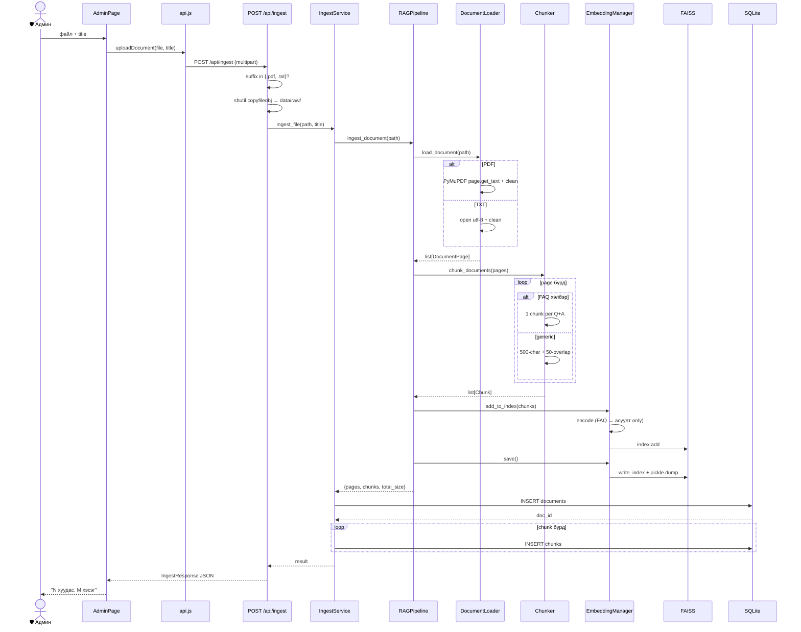

# 3.5 Баримт бичиг оруулах дарааллын диаграм

> **Зураг 3.5.** Админий баримт upload + ingestion дараалал.
> Эх сурвалж файлууд: `backend/app/api/routes.py:61` (`ingest_document()`), `backend/app/services/ingest_service.py:19` (`ingest_file()`), `rag/pipeline.py:48` (`ingest_document()`), `rag/document_loader.py:94`, `rag/chunker.py:120`, `rag/embeddings.py:95`.
> Source: `docs/diagrams/source/05_sequence_ingest_flow.puml` · `docs/diagrams/source/05_sequence_ingest_flow.mmd`
> Rendered: `docs/diagrams/rendered/05_sequence_ingest_flow.png`

## Диаграм

## Тайлбар

Уг диаграм нь **админ шинэ баримт оруулах процессын бүх алхамыг** хугацааны дараалаар харуулна. Frontend AdminPage-аас файл сонгох мөчөөс эхлээд SQLite-д metadata бичигдэх хүртэлх 12 өвөрмөц алхам бүгд кодоор баталгаажсан.

### Алхам бүрийн тайлбар

**Алхам 1–3: Файл хүлээн авах ба шалгах.** Frontend нь `<input type="file" accept=".pdf,.txt">` ашиглан файлын төрлийг урьдчилан хязгаарлана. `multipart/form-data` хэлбэрээр `POST /api/ingest`-руу илгээгдэх ба backend `routes.py:74-78`-д Python `pathlib.Path.suffix.lower()`-ыг ашиглан дахин шалгана. Зөвшөөрөгдсөн `{".pdf", ".txt"}`-аас гаднах файл нь HTTP 400 алдаа буцаана.

**Алхам 4: Disk-д хадгалах.** `shutil.copyfileobj(file.file, f)` нь UploadFile object-ийг чанк-чанкаар `data/raw/<filename>`-руу хадгална. Энэ нь том файлыг RAM-д бүрэн ачаалахгүйгээр streaming хэлбэрээр хадгалдаг.

**Алхам 5–6: IngestService → RAGPipeline.** `IngestService.ingest_file(file_path, title)` нь `RAGPipeline.ingest_document(file_path)`-ыг дотроос дуудна. Үүнээс өмнө `old_count = self.rag.embedding_manager.index.ntotal`-ыг хадгалж дараа шинэ chunk-ийн тоог тооцоолоход ашигладаг.

**Алхам 7–8: Document Loader.** PDF файлд `fitz.open(file_path)` ашиглаж page тус бүрд `page.get_text("text")`-ээр текст гаргана, `clean_extracted_text()`-ээр PDF-ийн нийтлэг шок (excessive newlines, hyphenated breaks)-уудыг засна. TXT файлд UTF-8-аар уншина. Үр дүнд `list[DocumentPage]` буцаана.

**Алхам 9: Chunking.** `chunk_documents()` нь page бүр дээр **FAQ detection** хийнэ — `_FAQ_MARKER_RE = re.compile(r"###\s*FAQ\s*\d+")` болон `_FAQ_QUESTION_RE / _FAQ_ANSWER_RE` хосолсон шалгалт. FAQ хэлбэрийн файлд `_parse_faq_entries()` нь *(full_block, question, answer)* tuple-уудыг үүсгэн, нэг entry = нэг chunk болгон хадгална, `metadata`-д `is_faq=True, faq_question, faq_answer` түлхүүрүүдийг тэмдэглэнэ. Эс бөгөөс `chunk_text()` нь sentence-boundary-aware character chunking-ийг 500-тэмдэгтийн `chunk_size`, 50-тэмдэгтийн `overlap`-аар хийнэ.

**Алхам 10: Embedding ба FAISS-д нэмэх.** `EmbeddingManager.add_to_index(new_chunks)`:
- `_embed_text_for_chunk(c)` — FAQ chunk бол зөвхөн `metadata["faq_question"]`-ийг embedding хийнэ. Энэ нь хэрэглэгчийн query (асуулт хэлбэртэй) болон FAQ entry хоорондын cosine similarity-ийг ихэсгэдэг гол ухаан.
- `model.encode(texts, normalize_embeddings=True, batch_size=32)` — sentence-transformers-аар (1, 384) float32 vectors үүсгэнэ. `normalize=True` нь IndexFlatIP-ийн inner product-ыг cosine similarity-тэй адил болгодог.
- `index.add(embeddings)` — FAISS index-д нэмэх.
- `self.chunks.extend(new_chunks)` — Python `list[Chunk]`-нд нэмэх (FAISS index ID-аас Chunk-руу буцах map).

**Алхам 11: Файлд хадгалах.** `EmbeddingManager.save()`:
- `faiss.write_index(self.index, "data/vectors/index.faiss")`
- `pickle.dump(self.chunks, "data/vectors/chunks.pkl")`

**Алхам 12: SQLite metadata.** `IngestService` дотор `INSERT OR REPLACE INTO documents (...)`-аар document мөр нэмж `doc_id` авна, дараа chunk бүрд `INSERT OR REPLACE INTO chunks (document_id, chunk_id, ...)`. SQLite WAL mode тул concurrent reads-д блок үүсгэхгүй.

### Атомик-тоост хэлэх боломжгүй

Анхаарал татах: бүх алхам **нэг database transaction дотор биш**. `with get_db() as conn:` дээр зөвхөн SQL хэсэг автомат rollback хийнэ. Хэрэв FAISS write амжилттай боловч SQL INSERT алдаа гарвал хоёр storage хооронд зөрчил үүснэ. Дипломын *future improvement* хэсэгт «transactional ingestion» гэж тэмдэглэх хэрэгтэй.

## Дипломын ажилд оруулах тайлбар

Уг диаграмыг *«3.5 Баримт оруулах процесс»* эсвэл *«3.5 Knowledge base management»* хэсэгт оруулна. Энэ нь:

1. **Динамик мэдлэгийн сан** — систем нь анхны seed data-д хязгаарлагдахгүй. Шинэ хууль батлагдсан үед админ upload хийсэн хормоос эхлэн систем тэр баримтыг ашиглаж эхэлдэг.
2. **FAQ-aware ingestion** — стандарт RAG-аас давсан, **системийн өвөрмөц шинж**: FAQ entry-уудыг бүтнээр нэг chunk хэлбэрээр хадгална, embedding нь зөвхөн асуулт текстээс үүсэх.
3. **Хэрэгцээтэй сайжруулалт (тайлан-д тайлбарлах)** — atomicity байхгүй, async background job хийгдээгүй (том файлыг upload хийхэд request hang болно).

## Хамгаалалтын үеэр товчоор тайлбарлах

«Админ AdminPage-аар PDF/TXT файл upload хийх үед backend нь файлын төрлийг шалгаад data/raw/ дотор хадгална. Дараа RAGPipeline нь PyMuPDF-аар текст гаргаж, FAQ хэлбэр эсэхийг автоматаар шалгана — FAQ бол entry бүрээр нэг chunk үүсгэх, эс бөгөөс 500-тэмдэгтийн overlap-тай char-level chunking хийгээд multilingual MiniLM-аар embedding үүсгэн FAISS-д нэмж файл руу бичнэ. Эцэст нь IngestService SQLite-ийн documents болон chunks хүснэгтэд metadata бичнэ. Frontend дээр “N хуудас, M хэсэг” гэсэн амжилтын мэдэгдэл харагдана.»
