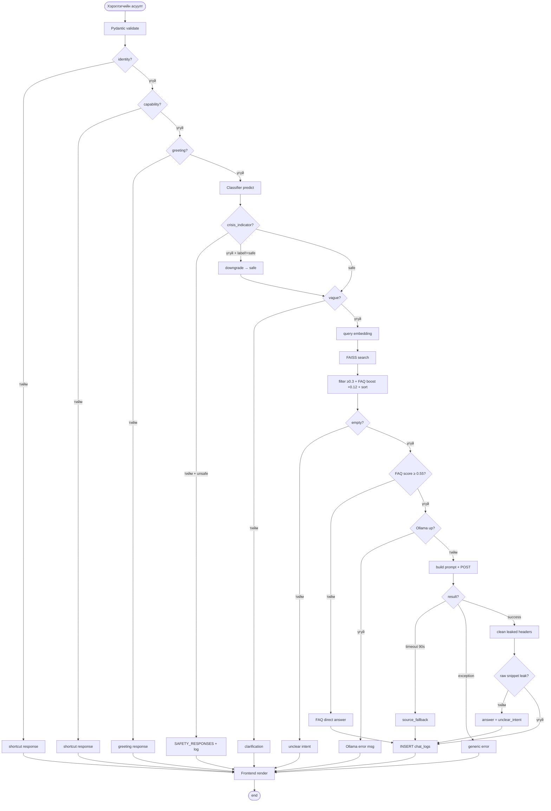

# 3.6 RAG боловсруулах үйл ажиллагааны диаграм

> **Зураг 3.6.** RAG retrieval + generation activity diagram, бүх decision branch болон error handling-той.
> Эх сурвалж файлууд: `backend/app/services/chat_service.py:272`, `rag/pipeline.py:97`, `rag/embeddings.py:105`, `rag/generator.py:252`, `rag/config.py`.
> Source: `docs/diagrams/source/06_activity_rag_flow.puml` · `docs/diagrams/source/06_activity_rag_flow.mmd`
> Rendered: `docs/diagrams/rendered/06_activity_rag_flow.png`

## Диаграм

## Тайлбар

Уг үйл ажиллагааны диаграм нь **нэг хэрэглэгчийн асуултыг боловсруулах бүх боломжит замналыг** (decision branch-ууд, error branches, alternative shortcuts) нэг зурганд багтаасан. Sequence diagram (3.4)-аас ялгаатай нь хугацааны дараалал дээр биш, *control flow*-ийн дээр төвлөрдөг.

### Гол branch-ууд

**Shortcut давхарга (3 урьдчилсан reject node):** identity, capability, greeting гэсэн гурван regex-based pattern-уудаас аль нэгтэй таарвал classifier-аас өмнө хариу буцна. Энэ нь:
- LLM-ийн нөөцийг хэмнэх.
- Classifier-ийн false-positive-ыг бууруулах (*«туслаач»*, *«чи юу хийж чадах вэ»* гэх мэт мэт ил тод аюулгүй query-нүүд аюултай ангилалд орохгүй).

**Safety давхарга:** Classifier нь TF-IDF feature-аас 5-ангилалд predict_proba гаргаж, confidence < 0.5 үед `safe`-руу буцаах нэгдүгээр хамгаалалт байна. Дараа `crisis_indicator` regex-аас `үхмээр`, `амьдрахгүй`, `амиа` гэх мэт жинхэнэ хямралын үг хайдаг — олдоогүй боловч `self_harm` эсвэл `harassment` гэж тэмдэглэгдсэн бол `safe`-руу downgrade хийнэ. Энэ нь системийн **жинхэнэ ухаалаг шинж** — простой classifier дангаараа Mongolian-д false positive-ыг бууруулж чаддаггүй учир context-aware downgrade нэмэгдсэн.

**Vague-query давхарга:** Classifier-ийг даассан query (жишээ: *«яах вэ?»*, *«хэрхэн?»*) болон 5-тэмдэгтээс богино query-уудад `_CLARIFICATION_RESPONSE`-ыг буцаана.

**Retrieval давхарга:** `_CATEGORY_CONTEXT[category]` дотор сонгосон ангиллын тайлбар prefix-ыг асуултын өмнө залгана (жишээ нь `gender_equality` бол `«Хүйсийн тэгш эрх, жендэрийн бодлого, ... :»`). Дараа embedding → FAISS IndexFlatIP search → similarity_threshold=0.3 шүүлт → FAQ chunk-уудад +0.12 score boost → score-аар sort-ийн дараа `top_k=2`. Олдоогүй бол `_UNCLEAR_INTENT_RESPONSE`.

**Generation давхарга:** Энд **дөрвөн боломжит зам**:
1. **FAQ fast-path** — top.is_faq && score ≥ 0.55 → metadata.faq_answer-ыг шууд буцаана.
2. **Ollama down** — health check fail → «Ollama ажиллахгүй байна» гэсэн Mongolian мэдэгдэл.
3. **Ollama timeout (90s)** — `_source_fallback()` нь *«хариу үүсгэхэд хугацаа хэтэрлээ — холбогдох эх сурвалжуудыг доор харуулав, асуултаа товчоор бичээрэй»*.
4. **Successful generation** — POST /api/chat → ConvertJSON → `_clean_llm_answer` (citation header strip).

**Post-generation sanity check:** `_looks_like_raw_snippet` нь `^\s*\[\s*\d+\s*\]\s*\S+\.(pdf|txt|md|docx?)` гэсэн pattern-аар LLM-ийн raw context leak-ийг илрүүлдэг. Олдвол `_UNCLEAR_INTENT`-руу буцаана — uncluttered Mongolian UX-ыг хадгалах.

### Бүх path-уудын төгсгөл нь нэг цэгт

Хариу замнал ямар ч branch-ээр явсан бай: `_log_chat()` болон frontend-ийн `MessageBubble + SourcePanel + SafetyWarning` render. Энэ нь *«хэрэглэгчээс ямар ч query ирэх вий, хариу үргэлж буцна»* гэсэн тогтвортой UX зарчмыг хангадаг.

## Дипломын ажилд оруулах тайлбар

Уг диаграмыг *«3.6 RAG боловсруулах үйл явц»* хэсэгт оруулна. Энэ нь:

1. **Defense-in-depth** — олон давхарга хамгаалалт: shortcut → classifier → crisis-aware downgrade → vague check → retrieval threshold → post-generation leak detection.
2. **Graceful degradation** — Ollama unavailable, timeout, exception, эсвэл retrieval хоосон гэх мэт олон асуудалд хэрэглэгчид цэвэр Mongolian мэдээлэл өгнө.
3. **Latency optimization** — fast-path-уудаар хамгийн хямд branch-ыг эхэнд гүйцэтгэн дундаж latency-г ихээхэн бууруулдаг (FAQ fast-path-аар хариу 50ms-300ms, шууд Ollama call-аар 5–30s).

## Хамгаалалтын үеэр товчоор тайлбарлах

«Үйл ажиллагааны диаграм нь чат query-ийн боломжтой бүх замналыг харуулна. Identity / capability / greeting shortcut-ууд → classifier safety check → crisis-indicator-аар self_harm/harassment-ийн false positive downgrade → vague check → query embedding + FAISS search → FAQ fast-path эсвэл Ollama generation. Алхам бүрд error branch (Ollama down, timeout, exception, raw snippet leak) бий бөгөөд бүх branch-ийн төгсгөлд chat_logs-д лог хадгалагдаж frontend-руу JSON буцаана. Энэхүү multi-layer хяналт нь систем тогтвортой, predictable хариу өгөхийг баталгаажуулдаг.»
