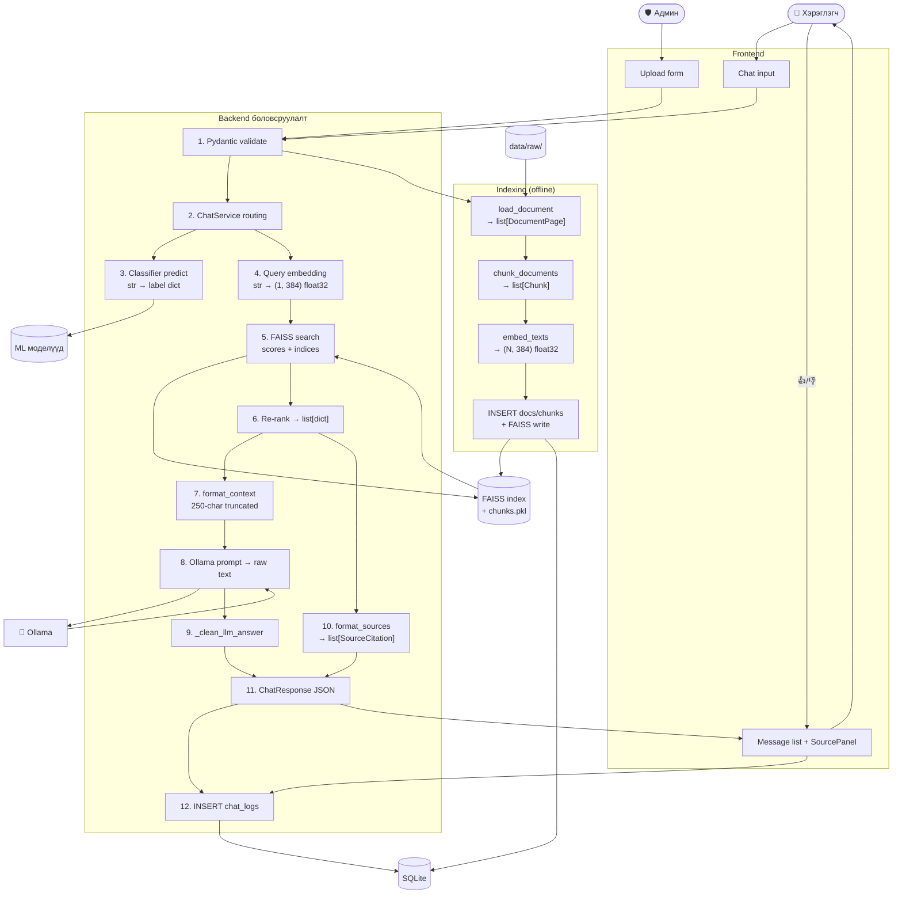

# 3.7 Өгөгдлийн урсгалын диаграм

> **Зураг 3.7.** Системийн дотоод өгөгдлийн хувирлын урсгал.
> Эх сурвалж файлууд: `backend/app/schemas/schemas.py`, `backend/app/services/chat_service.py`, `rag/embeddings.py`, `rag/generator.py:format_context`, `rag/generator.py:format_sources`, `backend/app/db/database.py`.
> Source: `docs/diagrams/source/07_data_flow_diagram.puml` · `docs/diagrams/source/07_data_flow_diagram.mmd`
> Rendered: `docs/diagrams/rendered/07_data_flow_diagram.png`

## Диаграм

## Тайлбар

Уг диаграм нь системийн **өгөгдлийн төлвийн өөрчлөлтийг** буюу нэг ширхэг өгөгдөл хэрхэн дамжин хувиралдаг улсыг харуулдаг. Sequence diagram (3.4) болон activity diagram (3.6)-аас ялгаатай нь *хугацаа* эсвэл *control flow* биш, *өгөгдлийн форматын хувирал* дээр төвлөрнө.

### Query урсгалын төлвийн дараалал

1. **Хэрэглэгчийн оролт** — Cyrillic Mongolian текст (макс 2000 тэмдэгт), JSON `{"message": "...", "category": "gender_equality"}` хэлбэрээр Frontend-ээс backend руу илгээгдэнэ.
2. **Pydantic validation** → `ChatRequest` объект (`min_length=1, max_length=2000` constraint-той).
3. **`ChatService` routing шалгуурууд** → `_normalize(query)` нь lowercase + strip-эд оруулна, regex match-ууд хийгдэнэ.
4. **Classifier-ийн оролт** — нормалчлагдсан str → `clean_mongolian_text` (URL/email хасах, `[^Ѐ-ӿ\s0-9]` ZSL-ээр зөвхөн Cyrillic үлдээх) → `remove_stopwords` (49 stopword) → TfidfVectorizer.transform(...) → sparse matrix (1, 5000).
5. **Predict** — sklearn LogisticRegression-аас `predict_proba` → 5 утгат numpy float array → `{label, confidence, is_safe}` dict.
6. **Query embedding** — `prefix + query` string → SentenceTransformer.encode → np.float32 (1, 384), L2-normalized.
7. **FAISS query** — IndexFlatIP search-аар `(scores, indices)` numpy array. Энд inner product = cosine similarity (vectors normalized).
8. **Re-rank logic** — score >= 0.3 шүүлт, FAQ chunk-д +0.12 boost, sorted descending, top_k=2 авна. Гаралт нь `list[dict]` — chunk_id, text, source_file, page_number, score, metadata-тай.
9. **Source citations** (parallel branch) — `format_sources(chunks)` нь `_get_doc_title()` (filename → human-readable Mongolian), `_extract_law_refs()` (regex: `(?:\d+(?:\.\d+)*)\s*(?:дугаар|дэх|...)\s*зүйл[ийн]*`), snippet truncation хийнэ. Үр дүн нь `list[SourceCitation]`.
10. **LLM context** — `format_context(chunks)` нь chunk-уудыг `[1] filename.pdf (х.3)\n<text up to 250 chars>` хэлбэрт хувиргана. _deduplicate_chunks-аар 60-тэмдэгтээс илүү overlap-той chunk-ууд хасагдана.
11. **Ollama HTTP body** — JSON: `{"model": "qwen2.5:7b", "messages": [{system}, {user}], "options": {"temperature": 0.15, "num_predict": 250}, "stream": False}`.
12. **Ollama хариу** — `{"message": {"content": "<Mongolian text>"}, "prompt_eval_count": N, "eval_count": M}`.
13. **Cleaning** — `_clean_llm_answer` нь `^\s*\[\s*\d+\s*\]\s*\S+\.(pdf|txt|md|docx?)` болон `^\s*Эх\s+сурвалж` regex-ээр iterative (4 удаа) leaked header-уудыг strip хийнэ.
14. **Final assembly** — `ChatResponse` Pydantic объект: `{answer, sources, safety, chat_id, response_time_ms, model_used}`.
15. **DB write** — `INSERT INTO chat_logs (...)`-аар row нэмж, lastrowid-ыг chat_id болгож буцаана.
16. **JSON response** — Frontend дотор `setMessages([..., assistantMessage])`, MessageBubble + SourcePanel react component-ууд render хийгдэнэ.

### Feedback урсгал

Хэрэглэгч thumbs up/down дарахад `submitFeedback(chat_id, rating)` дуудагдаж `POST /api/feedback` endpoint-аар `INSERT INTO feedback (chat_id, rating)` хийнэ. `feedback.chat_id` нь FK холбоосоор `chat_logs.id`-руу заана.

### Indexing урсгал (offline)

Админ upload-ийн зам нь дотоод data flow тийм цэвэр (chunked):
- File bytes → DocumentPage(text=cleaned_text) → Chunk(text=full_block, metadata={is_faq, faq_question}) → embedding numpy array → FAISS index дотор пакетлагдаж нэмэгдэнэ.
- Парлель: SQLite-ийн `documents` болон `chunks` хүснэгтэд тус бүр row үүсгэнэ.

### Privacy шинж

Хариу-ялгах өгөгдөл `chat_logs`-д хадгалагдах боловч хэрэглэгч-цэгийг танихаар үндэс байхгүй (no `user_id`, no IP, no session). Энэ нь дипломын *privacy considerations* хэсэгт оруулах сайн шинж юм.

## Дипломын ажилд оруулах тайлбар

Уг диаграмыг *«3.7 Өгөгдлийн урсгалын схем»* хэсэгт оруулна. Энэ нь:

1. **Тип системийн вэбмастер** — string → numpy float32 (1, 384) → list[dict] → string → JSON object → DB row гэх форматын хувирлуудыг тодорхой харуулна.
2. **Bottleneck цэгүүдийг харуулна** — Ollama call (B8 → Ollama → B9) бол хамгийн удаан цэг (5–30s); FAISS search ба classifier predict бол миллисекундийн ажил.
3. **Storage-ийн хосолсон шинж чанар** — vector store (FAISS) болон structured DB (SQLite) хоёрын data point хаана төрж буйг харуулна.

## Хамгаалалтын үеэр товчоор тайлбарлах

«Хэрэглэгчийн Cyrillic асуулт нь Pydantic-аар JSON validate хийгдэн, ChatService-руу хүрнэ. Classifier нь TF-IDF features-аас sparse matrix → LogReg predict_proba → label dict болж шалгана. RAG зам нь string → multilingual MiniLM embedding (1, 384 float32) → FAISS IndexFlatIP search → re-ranked list[dict] → numbered context string → Ollama HTTP body хүртэл хувирна. Хариулт ирмэгц citation header-ууд strip-р цэвэрлэгдэж, source citations болон safety info-той хамт ChatResponse JSON-руу хувирна. Эцэст нь chat_logs-д row нэмэгдэн frontend-руу буцна. Indexing замд бол file bytes → DocumentPage → Chunk → embedding → FAISS index + SQLite metadata-д параллель бичигдэнэ.»
