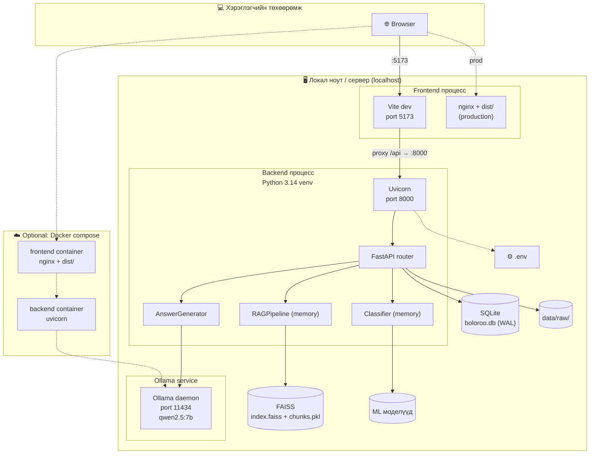

# 3.8 Системийн байршуулалтын диаграм

> **Зураг 3.8.** Boloroo системийн локал болон Docker-based deployment.
> Эх сурвалж файлууд: `backend/app/main.py`, `frontend/vite.config.js`, `docker-compose.yml`, `docker/Dockerfile.backend`, `docker/Dockerfile.frontend`, `docker/nginx.conf`, `rag/config.py:ollama_base_url`, `.env`, `.env.example`.
> Source: `docs/diagrams/source/08_deployment_diagram.puml` · `docs/diagrams/source/08_deployment_diagram.mmd`
> Rendered: `docs/diagrams/rendered/08_deployment_diagram.png`

## Диаграм

## Тайлбар

Boloroo системийн deployment загвар нь хоёр төрлийн орчинд тохирно: **локал development** (одоогийн анхдагч) болон **Docker compose** (сонголт, гэхдээ Ollama-руу хүрэх засвар шаардлагатай).

### Локал deployment (одоогийн анхдагч)

Хэрэглэгчийн нэг ноут буукт **гурван параллел процесс** ажиллана:

1. **Vite dev сервер (port 5173)** — Frontend dev. `npm run dev` ажиллуулах. Production бол `npm run build` нь `dist/` хавтсыг үүсгэн nginx эсвэл өөр static-server-р хангаж болно.

2. **Uvicorn FastAPI сервер (port 8000)** — Python 3.14 virtual environment дотор. Startup-д lifespan нь:
   - SQLite database-г нээж `init_db()`-ээр хүснэгтүүдийг үүсгэх.
   - FAISS index файлыг RAM руу ачаалах (3408 vector × 384 float32 ≈ 5 MB ширхэг + Python list[Chunk] объект).
   - `SensitiveContentClassifier`-ийг `joblib.load(...)`-аар pickle файлуудаас ачаалах.
   - `ChatService` болон `IngestService` объектуудыг үүсгэн `routes.chat_service`-руу inject хийнэ.

3. **Ollama daemon (port 11434)** — `ollama serve` гэдэг тусгай процесс. `qwen2.5:7b` загвар нь ~4.7 GB (Q4_K_M квантизац). Memory footprint ажиллах үед ~5 GB.

### Файлын persistence

`Host` доторх дараах файлууд нь системийн state-ийг хадгална:
- `data/vectors/index.faiss` (5 MB) + `data/vectors/chunks.pkl` (3 MB) — vector store.
- `data/boloroo.db` (~122 KB одоогоор) — SQLite, WAL mode.
- `training/models/sensitive_classifier.pkl` (58 KB) + `tfidf_vectorizer.pkl` (53 KB).
- `data/raw/` (~1.8 MB) — 5 PDF + 7 TXT эх баримт.
- `.env` — локал тохиргоо. Backend startup-д `python-dotenv` ачаална.

### Орчны нөөцийн шаардлага

| Нөөц | Хэмжээ | Тайлбар |
|------|--------|---------|
| RAM | ~5–6 GB | Ollama 4.7 GB + sentence-transformer ~470 MB + FAISS ~5 MB + Backend ~200 MB |
| Disk | ~6 GB | qwen2.5:7b нэг л 4.7 GB |
| CPU | 4-core x86_64+ | GPU нэмэгдэхэд хариулт хурдан болно |
| Network | Локал | Гадаад API-руу хандахгүй |

### Docker сонголт

`docker-compose.yml` дотор `frontend` ба `backend` гэсэн хоёр container тодорхойлсон. Frontend container нь nginx + dist-ийг хост-руу port 80, backend container нь uvicorn-аар port 8000-ыг гаргана. **Гэхдээ:**
- Ollama service `docker-compose.yml`-д **байхгүй**. Ollama хост машин дээр ажиллах ёстой.
- Container дотор `localhost:11434` нь container-ын өөрийн loopback-руу заах ба хост Ollama-руу хүрэхгүй. Засвар: `OLLAMA_BASE_URL=http://host.docker.internal:11434` тохируулж `extra_hosts: ["host.docker.internal:host-gateway"]` нэмэх. Энэ засвар одоогоор хийгдээгүй (FIX_PLAN_MN.md дотор тэмдэглэгдсэн).

### Network connectivity

- **Browser → Vite (5173):** HTTP/JSON.
- **Vite → Uvicorn (8000):** Vite dev-server proxy дотор `target: 'http://localhost:8000', changeOrigin: true` (`vite.config.js:9-13`). Энэ нь CORS-ыг хялбарчилна.
- **Uvicorn → Ollama (11434):** loopback HTTP, FastAPI backend-ээс `requests.post(...)` хийх. `OLLAMA_BASE_URL` env var-аар тохируулах.
- **Browser → Backend (production):** nginx /api proxy_pass (`docker/nginx.conf:11-16`).

### Хамгаалалтын өдөр анхаарах

Хамгаалалтын өдөр Ollama сервер заавал ажиллаж байх ёстой. Урьдчилсан шалгалтын скриптийг `scripts/check_demo.py`-ээр хийхийг зөвлөнө (FIX_PLAN_MN.md, Засвар №6).

## Дипломын ажилд оруулах тайлбар

Уг диаграмыг *«3.8 Системийн байршуулалт ба орчны шаардлага»* хэсэгт оруулна. Энэ нь:

1. **Local-only архитектур** — Монгол улсын ВУЗ-ын дипломын ажил-д cloud зардалгүй, demo-г ямар ч ноут буукт явуулах боломжтой.
2. **Process separation** — frontend, backend, LLM гэсэн 3 тусгай процесс. Жишээ нь Ollama-г өөр машинд шилжүүлэх боломжтой (config-ийн `OLLAMA_BASE_URL`-ыг өөрчилснөөр).
3. **File-based persistence** — Postgres/MongoDB шаарддаггүй, хувилгүй файл хэлбэрээр backup хийгдэх боломжтой.
4. **Production-readiness limitation** — single-tenant (нэг FAISS index, нэг SQLite). Enterprise scale-д PostgreSQL + Pinecone эсвэл Weaviate шилжих хэрэгтэй (future work).

## Хамгаалалтын үеэр товчоор тайлбарлах

«Систем нь хэрэглэгчийн нэг ноут буукт бүхэлдээ ажилладаг — гадаад үйлчилгээ, cloud хэрэглэдэггүй. 3 локал процесс ажиллана: Vite frontend (5173), Uvicorn backend (8000), Ollama LLM сервер (11434). Backend startup үед FAISS index болон ML загваруудыг RAM-руу ачаална. Бүх state нь файл хэлбэрээр локал disk дээр хадгалагдана: FAISS .faiss + chunks.pkl, SQLite .db, ML pickle. Docker compose сонголт байгаа боловч Ollama-руу хост-аас хүрэх extra_hosts тохиргоог нэмэх шаардлагатай. Системийн RAM шаардлага ~5–6 GB, GPU байхгүй ч CPU дээр CPU-friendly параметр сонгосон тул 16 GB ноут буукт хангалттай ажилладаг.»
