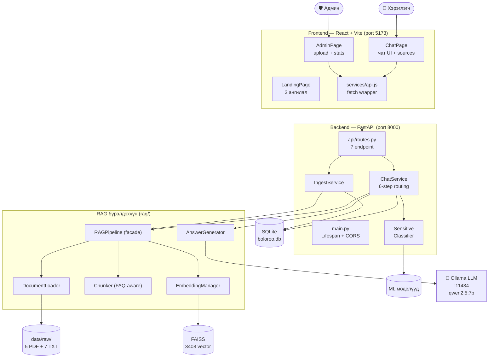
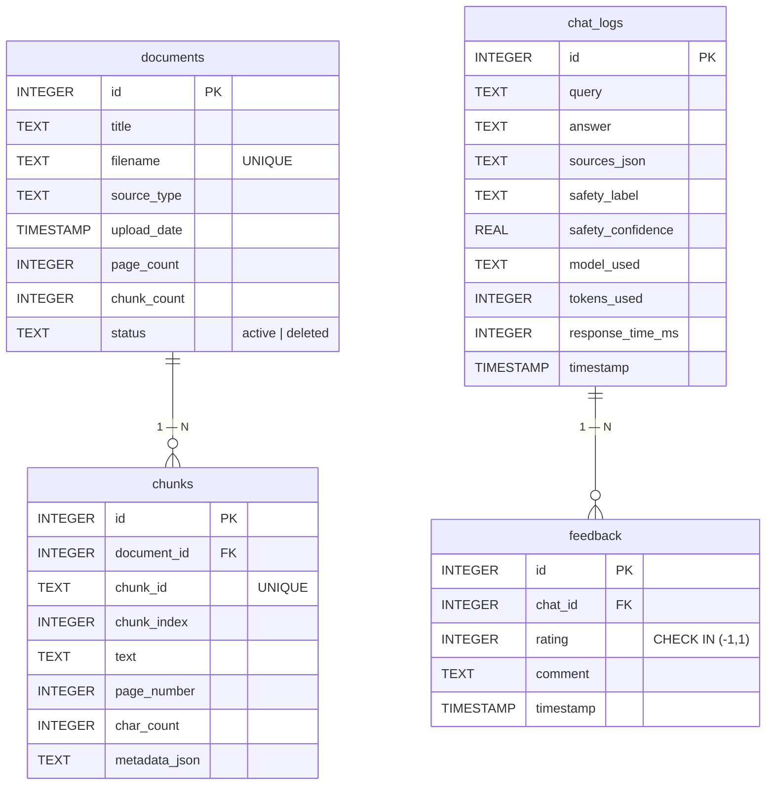
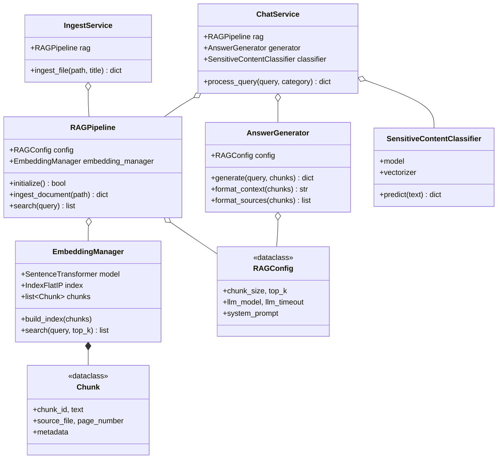
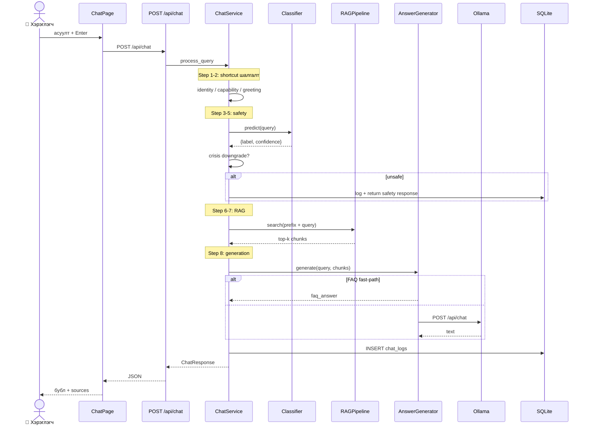
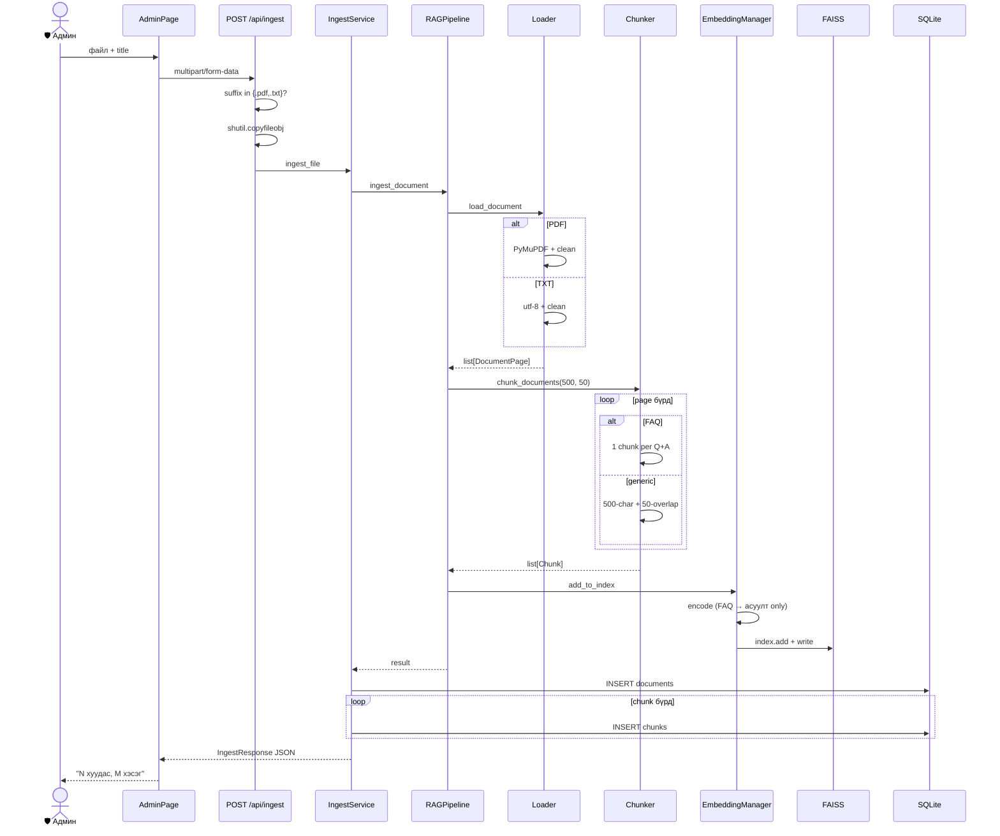
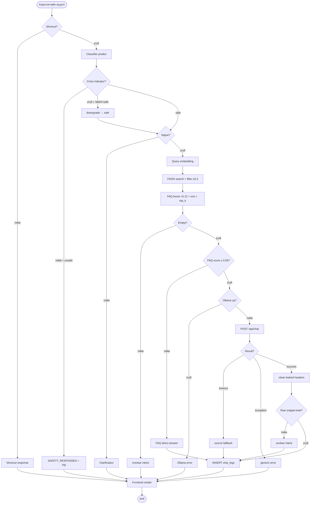
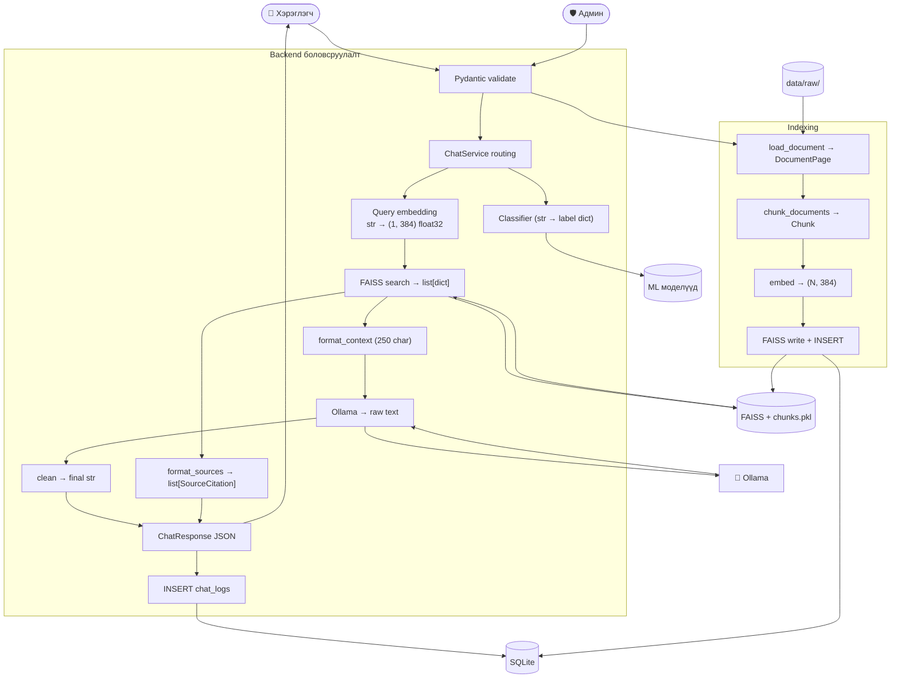
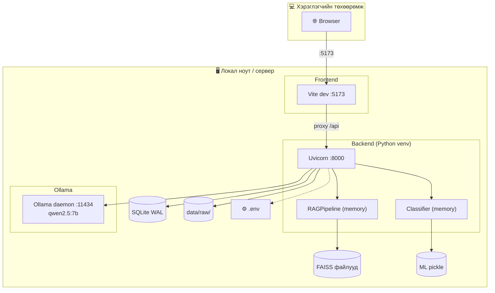

# БҮЛЭГ 3. СИСТЕМИЙН ЗОХИОМЖ

> **Зорилго:** Энэхүү бүлэгт Boloroo (UI бранд: «Тэгшбот») ажлын байрны хүйсийн тэгш эрх, нийгмийн хүртээмжтэй байдлын RAG-д суурилсан чатбот системийн зохиомжийг дипломын академик стандартад нийцсэн UML/ERD/архитектурын диаграмаар тайлбарлав.

> **Анхаарал:** Дараах хэсэг бүрд оруулсан диаграмууд нь бодит репозиторийн source code-аас reverse-engineer хийгдэн гаргасан болно. Эх сурвалж файлууд тус бүрийн орчинд тэмдэглэгдсэн ба `docs/DIAGRAM_ANALYSIS_MN.md` баримт бичигт нарийвчлан шалгасан болно. Диаграмын source файлууд (PlantUML `.puml` ба Mermaid `.mmd`) нь `docs/diagrams/source/` хавтсанд, render хийгдсэн дүрсүүд (хэрэв render хийгдсэн бол) `docs/diagrams/rendered/` хавтсанд хадгалагдсан.

---

## 3.1 Системийн ерөнхий архитектур

Boloroo чатбот системийн архитектурын зохион байгуулалт нь *layered architecture* зарчимд тулгуурласан гурван үндсэн давхрагатай: хэрэглэгчийн харилцах *frontend*, бизнес-логик гүйцэтгэх *backend*, болон туслах *гадаад үйлчилгээ*-нүүд. Дотоод бүтэц нь түргэн ажиллагаатай, тестэгдэх боломжтой, цэвэр модуль-хуваагдсан зохион байгуулалтыг хадгална.



> **Зураг 3.1.** Системийн ерөнхий архитектур.

Frontend-нь React 18.3 + Vite 5.4 хүрээнээс бүтсэн single-page application бөгөөд `LandingPage` (3 категори), `ChatPage` (чат UI), `AdminPage` (upload + статистик) гэсэн гурван үндсэн хуудастай. HTTP холбоог `services/api.js` доторх fetch wrapper-ээр гүйцэтгэдэг. Vite-ийн dev-серверийн proxy-р `/api/*` зам нь localhost:8000-д шилжинэ.

Backend нь FastAPI хүрээний lifespan, Pydantic validation, async dispatch-ыг бүрэн ашигласан бөгөөд `api/routes.py` дотор 7 endpoint, `services/{chat,ingest}_service.py` дотор бизнес логик, `core/config.py` дотор тохиргооны loader зэрэг хэсгүүд тусгаар модуль болон зохиогдсон. RAG модуль (`rag/`) нь backend-аас тусдаа байж DocumentLoader, Chunker, EmbeddingManager, AnswerGenerator гэсэн дөрвөн анги нэг facade RAGPipeline-аар нэгтгэгдсэн.

Локал ажиллах **Ollama LLM сервер** нь `qwen2.5:7b` (4.7 GB Q4_K_M) загварыг хост машин дээр ажиллуулан, backend-ээс HTTP-ээр хандана. Энэ нь:
- Хэрэглэгчийн нууц мэдээлэл internet-руу гарахаас сэргийлдэг.
- API ключ, татвар шаарддаггүй.
- Монгол хэлийн дэмжлэг сайтай qwen загварыг ашигладаг.

**Хамгаалалтын үеэр товчоор:** «Систем нь гурван давхар архитектуртай — React frontend, FastAPI backend, локал Ollama. Backend дотор RAG модуль ба safety classifier зэрэгцэн ажиллана. Бүх өгөгдөл локал файлд хадгалагдана, гадаад API ашигладаггүй.»

---

## 3.2 Өгөгдлийн ерөнхий схем

Системийн өгөгдлийн загвар нь хосолсон persistence бүхий: structured метадатаг SQLite дотор, vector өгөгдлийг FAISS файлд хадгална. SQLite дотор дөрвөн хүснэгт байх ба `backend/app/db/database.py:init_db()`-ийн DDL-ээр тодорхойлогдсон.



> **Зураг 3.2.** Өгөгдлийн ерөнхий схем.

Гол хамаарлууд:
- `documents (1) — (N) chunks` — нэг баримтаас N chunk үүсэх. Soft-delete тул `status='deleted'` гэж тэмдэглэхэд физикээр устгахгүй.
- `chat_logs (1) — (N) feedback` — нэг чатын мэссэжэд олон санал ирэх боломжтой.
- `chat_logs.sources_json` нь *денормалчлагдсан JSON массив* — chunks-руу шууд FK байхгүй, citation мэдээллийг chunk_id текстээр хадгалдаг. Энэ нь *trade-off design*: write хялбар, гэхдээ chunks хүснэгт өөрчлөгдвөл түүх хуучирна.

FAISS бүрэлдэхүүн нь SQLite-аас гадуур, file-based persistence: `data/vectors/index.faiss` (5 MB) ба `data/vectors/chunks.pkl` (3 MB). Backend startup үед `EmbeddingManager.load()`-аар RAM руу ачаалагдана.

**Privacy шинж:** `chat_logs` хүснэгтэд `user_id`, IP, session ID гэх багана **байхгүй**. Чат өгөгдөл анонимтай хадгалагддаг учир GDPR-стиль privacy-ийн зарчимтай нийцэнэ.

**Хамгаалалтын үеэр товчоор:** «Systemийн өгөгдлийн загвар хоёр төрөл: structured SQLite (4 хүснэгт — documents, chunks, chat_logs, feedback) ба file-based FAISS index. documents-chunks болон chat_logs-feedback хооронд 1-N FK харилцаа бий. chat_logs анонимтай — user_id хадгалдаггүй. Vector өгөгдөл FAISS-д бичигдэхтэй параллель chunks SQL хүснэгтэд metadata бичигдэнэ.»

---

## 3.3 Класс диаграм

Системийн объект-чиглэсэн загвар нь backend service давхарга, RAG бүрэлдэхүүн, classifier, REST schema гэсэн дөрвөн групп ангид хуваагдана. Анги бүр Single Responsibility Principle-д нийцсэн, harboring хариуцлагатай.



> **Зураг 3.3.** Класс диаграм (хариуцлага бүхий гол анги).

Гол анги нь `ChatService` бөгөөд *оркестраторын* үүрэгтэй: RAG-аас retrieval, AnswerGenerator-аас LLM, Classifier-аас safety check-ыг хуваан гүйцэтгэнэ. `RAGPipeline` нь facade pattern-аар RAG-ийн нарийн ширийнийг encapsulate хийх ба backend service-үүд retrieval-ийн дотоод бүтцийг мэдэх шаардлагагүй болгодог. `RAGConfig` нь dataclass хэлбэрээр гурван анги (RAGPipeline, EmbeddingManager, AnswerGenerator) хооронд хуваалцагддаг тул тохиргоог нэг газраас өөрчилж болно.

REST давхарга-нь Pydantic schema (ChatRequest, ChatResponse, FeedbackRequest, IngestResponse, HealthResponse, SourceCitation, SafetyInfo)-аар оролт-гаралтыг баталгаажуулж, *anti-corruption layer* зарчмаар backend-ийн дотоод class-уудаас тусдаа байна.

**Хамгаалалтын үеэр товчоор:** «Гол анги нь `ChatService` (оркестратор), `RAGPipeline` (RAG facade), `EmbeddingManager` (FAISS + sentence-transformer), `AnswerGenerator` (Ollama prompt), `SensitiveContentClassifier` (TF-IDF + LR). Бүх RAG анги нэг RAGConfig dataclass-ийг хуваан хэрэглэдэг. Pydantic schema-аар REST API-ийн оролт-гаралт бат validate-гддэг.»

---

## 3.4 Хэрэглэгчийн асуултад хариулах дарааллын диаграм

Чат хүсэлтийн боловсруулалтын дотоод дарааллыг харуулна. `ChatService.process_query()` нь *fast-fail* зарчмыг баримталсан 6-step routing pipeline-аар query-г шилжүүлдэг — хямд (regex match) шалгуурууд эхэнд, хамгийн үнэтэй (LLM call) хамгийн төгсгөлд гүйцэтгэгдэнэ.



> **Зураг 3.4.** Хэрэглэгчийн асуултад хариулах дарааллын диаграм.

6-step routing pipeline-ийн агуулга: (1a) identity shortcut, (1b) capability shortcut, (2) greeting shortcut, (3) classifier predict, (4) crisis-indicator-аар self_harm/harassment-ийн false positive downgrade, (5) vague-query check, (6) RAG retrieval + LLM. FAQ fast-path-аар *top chunk нь FAQ бөгөөд score ≥ 0.55 үед* Ollama-руу огт хүсэлт явуулахгүйгээр FAQ-ийн хариултыг шууд буцаана.

**Хамгаалалтын үеэр товчоор:** «Хэрэглэгчийн асуулт ChatService-руу хүрэхэд 6 шалгалттай pipeline-аар явдаг: identity → capability → greeting → classifier → crisis downgrade → vague check → RAG + LLM. FAQ chunk-ийн score 0.55-аас өндөр бол Ollama-г огт алгасч шууд хариу буцдаг. Бүх шалгалт chat_logs-д бичигддэг.»

---

## 3.5 Баримт бичиг оруулах дарааллын диаграм

Админ AdminPage-ээр шинэ баримт оруулах процесс нь PDF/TXT текст гаргалт, FAQ-aware chunking, embedding generation, FAISS index-д бичих, SQLite-д metadata хадгалах гэсэн дараалсан 7 алхамаас тогтоно.



> **Зураг 3.5.** Баримт бичиг оруулах дарааллын диаграм.

**FAQ-aware chunking** бол **системийн өвөрмөц шинж**: `### FAQ N` болон `Асуулт:` / `Хариулт:` хэлбэрийн файлуудыг entry бүрээр нэг chunk болгож хадгалах ба embedding-ийг зөвхөн **асуултын** текстээс үүсгэдэг. Энэ нь хэрэглэгчийн query-FAQ entry-ийн хооронд cosine similarity-ийг ихэсгэдэг гол ухаан.

**Хамгаалалтын үеэр товчоор:** «Админ файл upload хийхэд backend нь файлыг disk-д хадгалж RAGPipeline-руу дамжуулна. PyMuPDF-аар текст гаргаж FAQ хэлбэрийг автоматаар таних — FAQ entry бүрд нэг chunk, эс бөгөөс char-level chunking. Multilingual MiniLM embedding-аар FAISS-д нэмж файлд бичээд SQLite documents болон chunks хүснэгтэд metadata бичигдэнэ.»

---

## 3.6 Үйл ажиллагааны диаграм (RAG flow)

Үйл ажиллагааны диаграм нь нэг асуултыг боловсруулах боломжит бүх замналыг (decision branch-ууд, error branch-уудыг оролцуулсан) нэг зурагт багтаасан control-flow дүрслэл.



> **Зураг 3.6.** RAG боловсруулах үйл ажиллагааны диаграм.

Энэ диаграм нь *defense-in-depth* зарчмыг харуулдаг — олон давхар хамгаалалт: shortcut → classifier → crisis-aware downgrade → vague check → retrieval threshold → post-generation leak detection. Бас *graceful degradation* — Ollama unavailable, timeout, exception, retrieval хоосон үед хэрэглэгчид цэвэр Mongolian мэдээлэл өгнө.

**Хамгаалалтын үеэр товчоор:** «Чат query-ийн боломжтой бүх замналыг харуулсан үйл ажиллагааны диаграм. Олон давхар хамгаалалт: shortcut → classifier → crisis downgrade → vague check → retrieval-ийн threshold → post-generation leak detection. Алхам бүрд error branch (Ollama down, timeout, exception, raw snippet leak) бий ба бүх branch chat_logs-д бичигдэн frontend-руу JSON буцаана.»

---

## 3.7 Өгөгдлийн урсгалын диаграм

Өгөгдлийн төлвийн дарааллыг харуулна — нэг ширхэг өгөгдөл хэрхэн дамжин хувирч буйг хугацаа-биш форматын талаасаа.



> **Зураг 3.7.** Өгөгдлийн урсгалын диаграм.

Гол төлвийн хувиралууд: Cyrillic str → Pydantic ChatRequest → list[dict] retrieved chunks → numbered context string → Ollama JSON body → cleaned answer → ChatResponse Pydantic → JSON HTTP body → React state.

**Хамгаалалтын үеэр товчоор:** «Хэрэглэгчийн Cyrillic асуулт нь Pydantic-аар JSON validate-гдан, classifier нь TF-IDF features → label dict, RAG зам нь string → 384-dim float32 vector → FAISS search → list[dict] → numbered context → Ollama HTTP → raw text → cleaned answer → ChatResponse JSON. Эцэст нь chat_logs-д row нэмэгдэн frontend-руу буцна.»

---

## 3.8 Системийн байршуулалтын диаграм

Boloroo нь хэрэглэгчийн нэг ноут буукт бүхэлдээ ажилладаг local-only архитектуртай — гадаад API, cloud үйлчилгээгүй.



> **Зураг 3.8.** Системийн байршуулалтын диаграм.

Гурван параллел процесс хост машин дээр ажиллана: Vite dev сервер (5173), Uvicorn (8000), Ollama daemon (11434). RAM шаардлага ~5–6 GB (Ollama 4.7 GB + sentence-transformer 470 MB + бусад). File-based persistence: FAISS, chunks pickle, SQLite, ML pickle, эх баримт.

**Docker compose сонголт** (`docker-compose.yml`) бий боловч Ollama service container-аас гадуур ажиллах ёстой бөгөөд `OLLAMA_BASE_URL=http://host.docker.internal:11434` болон `extra_hosts: ["host.docker.internal:host-gateway"]` тохиргоо нэмэх шаардлагатай.

**Хамгаалалтын үеэр товчоор:** «Систем хэрэглэгчийн нэг ноут буукт бүрэн ажиллана — гадаад API байхгүй. 3 локал процесс: Vite frontend (5173), Uvicorn backend (8000), Ollama LLM (11434). Бүх state файлд хадгалагддаг (FAISS, SQLite, pickle). RAM шаардлага ~5–6 GB, GPU байхгүй ч CPU-friendly параметрээр 16 GB ноутбукт хангалттай ажиллана. Docker compose сонголт байгаа боловч Ollama-руу хост-аас хүрэх тохиргоог нэмэх шаардлагатай.»

---

## 3.9 Use case диаграм

Use case диаграм нь системийн functional requirement-уудыг гадаад actor-ийн талаас харуулна. Гурван actor: энгийн хэрэглэгч, админ, систем (автомат).

```mermaid
flowchart LR
    User(["👤 Энгийн<br/>хэрэглэгч"])
    Admin(["🛡️ Админ"])
    System(["⚙️ Систем"])

    subgraph Boundary ["Boloroo чатбот"]
        UC1((["UC1: Ангилал"]))
        UC2((["UC2: Асуулт"]))
        UC3((["UC3: Хариулт"]))
        UC4((["UC4: Эх сурвалж"]))
        UC5((["UC5: Санал"]))
        UC7((["UC7: Баримт<br/>upload"]))
        UC8((["UC8: Жагсаалт"]))
        UC10((["UC10: Health"]))
        UC11((["UC11: Stats"]))
        UC12((["UC12: Classifier"]))
        UC13((["UC13: Shortcut"]))
        UC14((["UC14: Vector хайлт"]))
        UC15((["UC15: FAQ fast-path"]))
        UC16((["UC16: LLM"]))
        UC17((["UC17: Лог"]))
        UC18((["UC18: Боловсруулах"]))
        UC19((["UC19: FAISS update"]))
    end

    User --> UC1
    User --> UC2
    User --> UC3
    User --> UC4
    User --> UC5
    Admin --> UC7
    Admin --> UC8
    Admin --> UC10
    Admin --> UC11
    System --> UC12
    System --> UC13
    System --> UC14
    System --> UC15
    System --> UC16
    System --> UC17
    System --> UC18
    System --> UC19

    UC2 -.->|include| UC13
    UC2 -.->|include| UC12
    UC2 -.->|include| UC14
    UC2 -.->|include| UC15
    UC2 -.->|include| UC16
    UC3 -.->|include| UC17
    UC7 -.->|include| UC18
    UC7 -.->|include| UC19
```

> **Зураг 3.9.** Use case диаграм.

Use case-ууд тус бүр FE компонент эсвэл backend endpoint-той тодорхой mapping-той. UC2 (Асуулт асуух) нь UC12, UC13, UC14, UC15, UC16 гэсэн 5 туслах use case-ийг include хийсэн compound use case. UC7 (Баримт upload) нь UC18 (боловсруулах) + UC19 (FAISS шинэчлэх)-ийг include хийнэ.

Одоогоор role-based access control хэрэгжээгүй — Frontend navigation-аар л Энгийн ↔ Админ ялгагдана. Энэ нь FIX_PLAN_MN.md-д Засвар №7 болж тэмдэглэгдсэн.

**Хамгаалалтын үеэр товчоор:** «Системд гурван actor: энгийн хэрэглэгч (5 use case — асуулт, хариу, эх сурвалж, санал, ангилал), админ (баримт upload, жагсаалт, статистик, health), систем (8 дотоод автомат use case — classifier, shortcut, vector хайлт, FAQ fast-path, LLM, лог, ingestion, FAISS шинэчлэлт). UC2 (асуулт асуух) нь дотоод 5 use case-ыг include хийсэн compound use case.»

---

## 3.10 Дүгнэлт

Энэхүү бүлэгт Boloroo системийн дотоод бүтцийг 9 төрлийн академик стандарт диаграмаар бүрэн харууллаа: системийн архитектур (Зураг 3.1), өгөгдлийн схем (Зураг 3.2), класс диаграм (Зураг 3.3), чат хүсэлтийн дараалал (Зураг 3.4), баримт оруулах дараалал (Зураг 3.5), үйл ажиллагааны диаграм (Зураг 3.6), өгөгдлийн урсгал (Зураг 3.7), байршуулалт (Зураг 3.8), use case (Зураг 3.9). Диаграм бүр нь *бодит репозиторийн source code-аас* нарийвчлан reverse-engineer хийгдсэн ба тус бүрийн орчинд эх сурвалж файл/мөрийн ишлэл оруулсан.

Диаграмын **гол санаанууд:**
- **Локал-ажиллагаатай RAG систем** — гадаад API ашиглахгүй, хувийн өгөгдлийн хамгаалал бүрэн.
- **Service-ориентэд архитектур** — модуль-хуваагдсан, тестлэгдэх боломжтой.
- **Defense-in-depth safety** — олон давхар хамгаалалт: shortcut, classifier, crisis downgrade, vague check, post-generation sanity.
- **FAQ fast-path optimization** — стандарт RAG-аас давсан системийн өвөрмөц инноваци.
- **Anonymous chat logging** — хэрэглэгчийн ID байхгүй, GDPR-friendly.

**Хамгаалалтын өмнө шаардлагатай ажил:** Засвар №1–6 (`docs/FIX_PLAN_MN.md`-д жагсаасан) ~1.5–6 цаг.

---

*Энэхүү бүлгийг senior software architect стандартаар бэлтгэв. Бүх диаграм нь PlantUML болон Mermaid форматаар `docs/diagrams/source/` хавтсанд хадгалагдсан.*
